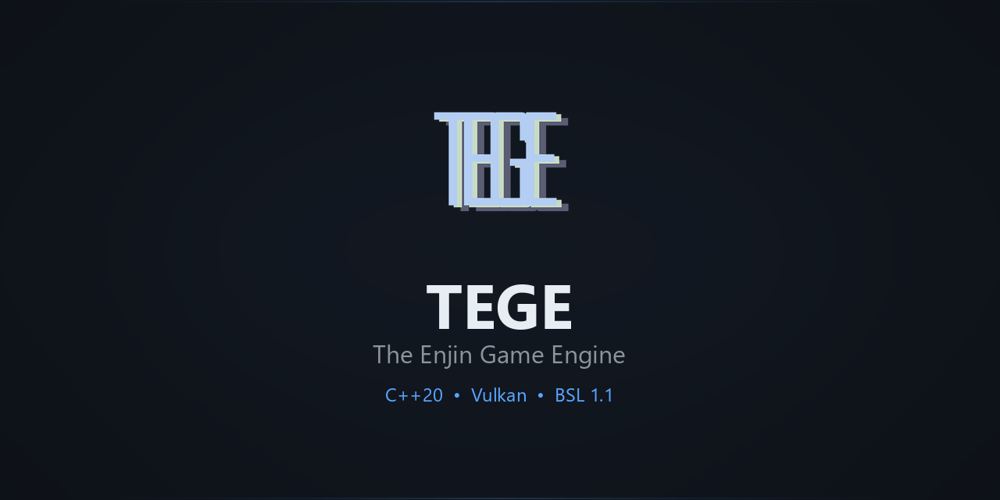
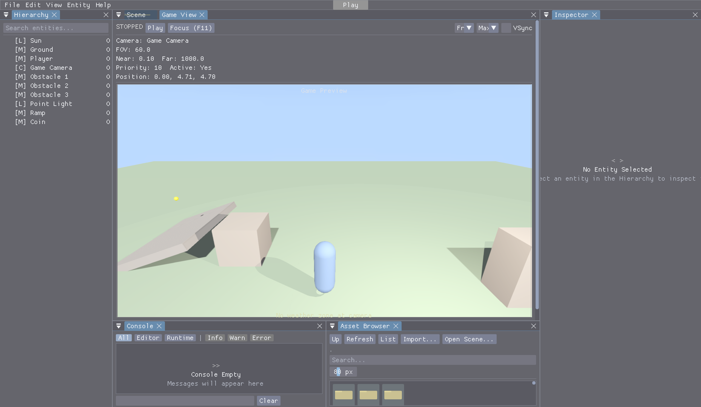
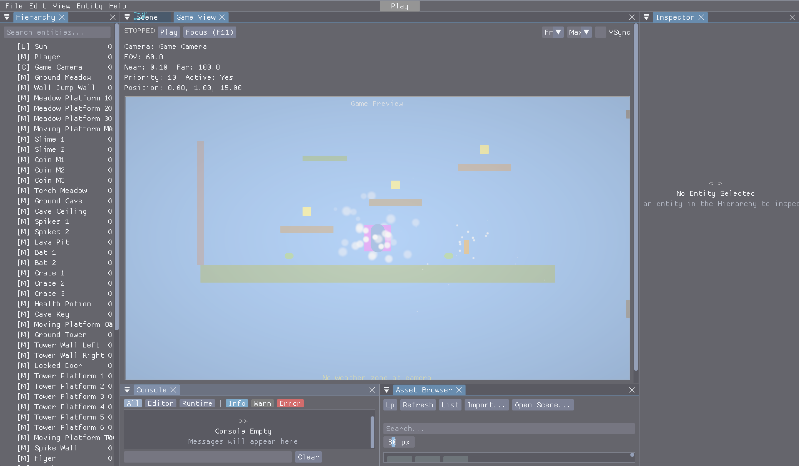
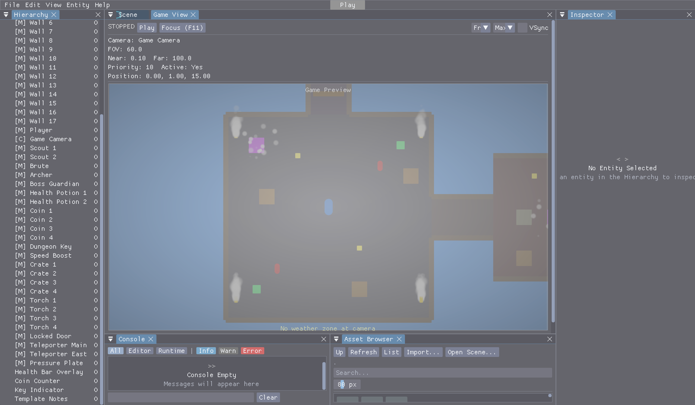

<div align="center">



<br><br>

**An aesthetics-first game engine built from scratch in C++20 and Vulkan.**

<br>

[](LICENSE)
[](https://en.cppreference.com/w/cpp/20)
[](https://www.vulkan.org/)
[]()
[](https://cmake.org/)
[]()

<br>

[Website](https://www.marty64.net/enjin/) · [Download](https://www.marty64.net/enjin/TEGE-0.9.6.zip) · [Documentation](docs/) · [Build Guide](docs/BUILD.md) · [Scripting API](docs/SCRIPTING_API.md)

</div>

---

## Screenshots

<table>
<tr>
<td width="33%" align="center">

<br><sub><b>3D Third Person</b> -- PBR renderer, cascaded shadows, terrain</sub>
</td>
<td width="33%" align="center">

<br><sub><b>2D Platformer</b> -- Sprite rendering, Box2D physics, particles</sub>
</td>
<td width="33%" align="center">

<br><sub><b>Top-Down Dungeon</b> -- Tile-based levels, AI, lighting</sub>
</td>
</tr>
</table>

> Full editor with hierarchy, inspector, viewport, console, and asset browser. 48 starter templates across 7 categories.

---

## Why TEGE?

TEGE is a complete game engine -- editor, renderer, physics, scripting, audio, build pipeline -- written from scratch. It ships with everything you need to make and publish a game, from 2D platformers to 3D open worlds.

| | |
|:---|:---|
| **Complete Editor** | Hierarchy, inspector, viewport, play mode, undo/redo, command palette, project hub, 48 starter templates, drag-and-drop import with validation |
| **80+ ECS Components** | Transform, mesh, material, lights, cameras, physics, AI, UI, audio, scripting, rewind, pose library -- all with inspector UI |
| **Vulkan PBR Renderer** | Cascaded shadows, reflection probes, path tracer, TAA/FXAA/SMAA, FSR 2 upscaling |
| **8 Art Styles** | Realistic PBR, Blinn-Phong, Hand-Painted, Cel/Toon, Low-Poly Retro, Pixel Art, NPR Sketch, Analog -- one-click presets |
| **Dual Scripting** | 960+ AngelScript bindings with hot-reload + visual scripting with 146+ nodes and breakpoint debugging |
| **Dual Physics** | Jolt 5.2.0 (3D) + Box2D 3.0.0 (2D), 5 character controller types, joints, ragdolls, sensors |
| **Ship Everywhere** | Standalone builds, HTML5/WebAssembly, Windows installer, Linux AppImage |
| **Gameplay Systems** | Save/load, quests, dialogue trees (quest/cinematic/flag integration), record & rewind, destructibles, LAN multiplayer, localization, dynamic difficulty, pose library |
| **Accessibility** | Colorblind correction (8 modes), screen reader, switch access, dyslexia mode, WCAG AAA themes |

---

## Quick Start

### Build from Source

```bash
# Clone
git clone https://github.com/MartyChouette/TEGE.git && cd TEGE

# Build
mkdir build && cd build
cmake ..
cmake --build . --config Release

# Run
./bin/Release/EnjinEditor.exe   # Windows
./bin/EnjinEditor               # Linux
```

**Prerequisites:** CMake 3.20+, a C++20 compiler, Vulkan SDK, GLFW3. See [BUILD.md](docs/BUILD.md) for detailed platform instructions.

**First time?** The [User Manual](docs/USER_MANUAL.md) walks through the editor and how to get started.

### Windows Installer

A pre-built Windows installer is available -- no build tools required:

1. Download **[TEGE-0.9.6.zip](https://www.marty64.net/enjin/TEGE-0.9.6.zip)** from the website
2. Run the installer -- it sets up the editor, player, and file associations (`.enjin`, `.enjscene`)
3. Launch TEGE from the Start Menu or desktop shortcut

### SimpleApp -- Minimal Rendering

For users who want Vulkan rendering without the full editor:

```cpp
#include "Enjin/SimpleApp.h"

class MyApp : public Enjin::SimpleApp {
    void OnStart() override {
        AddPlane({0, 0, 0}, 20.0f);
        AddCube({0, 0.5f, 0});
        AddDirectionalLight({0.5f, -1, -0.3f});
        SetCameraPosition({0, 4, 8});
    }
};
ENJIN_SIMPLE_MAIN(MyApp)
```

Build with `-DENJIN_BUILD_EXAMPLES=ON`. See `Examples/Simple3D/` and `Examples/Simple2D/`.

---

## Features

<details>
<summary><b>Rendering</b></summary>
<br>

- **PBR Materials** -- Base color, metallic, roughness, emissive, normal mapping, parallax occlusion (4 modes), transmission/IOR/thickness, subsurface scattering, matcap, procedural surface noise, material presets
- **Shadow Mapping** -- 4-cascade CSM, cubemap point shadows, spot shadows, 16-sample Poisson PCF, 6 dither patterns
- **Anti-Aliasing** -- TAA (Halton jitter, velocity reprojection), FXAA, SMAA
- **Post-Processing** -- Bloom, vignette, color grading, film grain, tone mapping, depth of field, tilt-shift, post-process volumes with spatial blending
- **Ray Tracing** -- Path tracer with NEE, MIS, Russian Roulette, Cook-Torrance BRDF. 3 denoisers (SVGF, Intel OIDN, NVIDIA OptiX). ReSTIR light sampling with temporal and spatial reuse. Hybrid RT effects (shadows, reflections, AO, GI) have shader source and C++ infrastructure but require manual SPIR-V compilation
- **Upscaling** -- FSR 2 (built-in Lanczos + CAS). 4 quality modes. DLSS/XeSS available when vendor SDKs are linked
- **Retro Effects** -- PSX vertex snapping, affine textures, flat/Gouraud shading, CRT scanlines (11 models), VHS, film gate weave, light leaks, 6 named palettes (PICO-8, Game Boy, NES, CGA, C64)
- **Environment** -- Procedural sky, cubemap skybox, weather (rain, snow, fog, storms), water with Gerstner waves, instanced vegetation with wind
- **Optimizations** -- GPU two-phase HiZ occlusion culling, clustered forward lighting, batched material SSBO, multi-draw indirect, async compute, SIMD math, per-frame linear allocator, descriptor set caching

</details>

<details>
<summary><b>Editor</b></summary>
<br>

- **Core** -- Hierarchy, inspector, viewport, play/pause/stop, undo/redo, cut/copy/paste, multi-select (Ctrl+click, Shift+range, marquee), entity icons
- **Gizmos** -- Translate/rotate/scale via ImGuizmo, click-to-select, terrain sculpting (5 brush modes), stats overlay, wireframe toggle
- **Visual Authoring** -- Shader Graph (54 nodes), Audio Event Graph, Particle Graph, Dialogue Tree Editor, Animation Graph, Vector Drawing Editor
- **Visual Scripting** -- Blueprint-style editor, 146+ nodes, breakpoint debugging (F9/F5/F10), execution profiler
- **Project Tools** -- Project Hub with 48 starter templates (7 categories), Template Creator, Template Marketplace
- **Smart Features** -- Context-aware suggestions, Quick Setup Patterns, Command Palette (Ctrl+P), keyboard shortcuts help
- **Debug** -- Game Debug Panel (F1), Debug Workstation (F2), Quake-style drop-down console (backtick, 60+ commands)
- **Collaboration** -- Real-time multi-user editing with OT protocol, peer cursors, conflict resolution
- **Build & Export** -- Build dialog, HTML5/WebAssembly export, standalone player builds
- **Drag & Drop** -- Drag textures from Asset Browser onto viewport entities or inspector fields, drag models to import, drag prefabs to instantiate

</details>

<details>
<summary><b>ECS & Gameplay</b></summary>
<br>

- **70+ Component Types** with full inspector UI
- **Character Controllers** -- Platformer 2D, Top-Down 2D/3D, Third Person, First Person, Surface Aligned
- **Physics** -- Jolt 5.2.0 (3D) + Box2D 3.0.0 (2D), collision detection, ground detection, sensor bodies, debug wireframes, 6 joint types, ragdolls
- **AI** -- Behavior Trees (20 node types, blackboard, visual editor), navmesh pathfinding (A*)
- **UI Runtime** -- Anchor-based layout, 8 widget types, 6 theme presets, font scaling, accessible labels
- **Save/Load** -- 10-slot system with quick save/load
- **Quest System** -- Start/complete/fail quests with objective tracking
- **Dialogue** -- Auto-built dialogue display with speaker, portrait, choices; Yarn/Twine import
- **Combat** -- Damage resistance/weakness multipliers, stamina/resource system
- **Localization** -- String tables, CSV/JSON I/O, parameterized strings, LOC() macro
- **Dynamic Difficulty** -- Auto-adjusts AI aggression, damage, resources based on player performance

</details>

<details>
<summary><b>Animation & Audio</b></summary>
<br>

- **Skeletal Animation** -- glTF + Assimp import (FBX/DAE/20+ formats), GPU skinning, animation state machines with blending
- **2D Sprite Animation** -- Frame-based flipbook animation
- **Inverse Kinematics** -- LookAt IK, FABRIK chain solving, interaction IK
- **Timeline Editor** -- Keyframe animation with layers, 4 interpolation modes, curve editor, onion skinning
- **Audio** -- miniaudio backend (WAV, MP3, FLAC, Vorbis), 3D spatialization, SFX/Music/UI/Voice channels, scene integration

</details>

<details>
<summary><b>Scripting & Plugins</b></summary>
<br>

- **AngelScript** -- TegeBehavior base class, ~960 API bindings, hot-reload, coroutines, event system
- **Visual Scripting** -- 146+ node types, breakpoint debugging, execution profiler, latent nodes
- **Plugin System** -- IPlugin interface, DLL/SO hot-reload with state save/restore
- **DataAssets** -- Schema definitions with typed instances, JSON I/O, script bindings

</details>

<details>
<summary><b>Accessibility</b></summary>
<br>

- **Vision** -- Colorblind correction (8 GPU modes), high contrast themes (WCAG AAA), font scaling, colorblind-safe palettes
- **Motor** -- Remappable input, one-handed presets, dwell-click, sticky drag, switch access
- **Cognitive** -- Dyslexia mode (OpenDyslexic font, spacing adjustments), reduced motion, content warnings
- **Communication** -- Screen reader, subtitles (configurable size/background/speaker), audio-visual indicators
- **Quick Presets** -- Low Vision, Motor Impaired, Photosensitive, Reset All

</details>

<details>
<summary><b>Build & Distribution</b></summary>
<br>

- **Asset Pipeline** -- `.enjpak` archive with compression and CRC32 integrity
- **Desktop** -- Windows EXE + Inno Setup installer, Linux AppImage, standalone player
- **Web** -- HTML5/WebAssembly via Emscripten, WebGPU renderer
- **Asset Libraries** -- 42 bundled fonts, 16 CC0 3D model packs, 15 CC0 2D sprite/tileset packs
- **Import** -- Presets for 10 DCC tools, texture compression (BCn/ASTC), auto-thumbnails

</details>

---

## Architecture

```
TEGE/
├── Core/           Foundation -- memory allocators, math, logging, platform abstraction
├── Engine/         Engine -- renderer, ECS, physics, audio, editor, scripting, build
│   └── shaders/    GLSL shaders (compiled to SPIR-V)
├── Editor/         Editor application (ImGui)
├── Player/         Standalone game player (no editor UI)
├── Tests/          1100+ unit and integration tests (18 categories)
├── third_party/    GLFW, ImGui, ImGuizmo
└── build/          Build output
```

The engine is split into two layers: **Core** (zero engine dependencies -- math, memory, logging, platform) and **Engine** (everything else). The Editor and Player are thin applications that compose Engine systems. All rendering goes through Vulkan 1.3 with a WebGPU path for web exports.

## Technology

| | |
|:---|:---|
| **Language** | C++20 |
| **Graphics** | Vulkan 1.3 + WebGPU (web) |
| **Audio** | miniaudio (public domain) |
| **Windowing** | GLFW3 (zlib/libpng) |
| **3D Import** | Assimp (BSD) |
| **UI** | Dear ImGui + ImGuizmo (MIT) |
| **JSON** | nlohmann/json (MIT) |
| **Physics** | Jolt 5.2.0 (MIT) + Box2D 3.0.0 (MIT) |
| **Build** | CMake 3.20+ |

All dependencies use permissive open-source licenses.

## Build Options

| Option | Default | Description |
|:-------|:--------|:------------|
| `ENJIN_BUILD_EDITOR` | ON | Editor application |
| `ENJIN_BUILD_PLAYER` | ON | Standalone game player |
| `ENJIN_BUILD_TESTS` | OFF | Unit tests (output: `bin/Tests/`) |
| `ENJIN_BUILD_EXAMPLES` | OFF | SimpleApp examples (output: `bin/Examples/`) |
| `ENJIN_PHYSICS_JOLT` | ON | Jolt 5.2.0 (3D physics) |
| `ENJIN_PHYSICS_BOX2D` | ON | Box2D 3.0.0 (2D physics) |
| `ENJIN_CLUSTERED_LIGHTING` | ON | Clustered forward lighting |
| `ENJIN_VRS` | OFF | Variable Rate Shading |
| `ENJIN_VIRTUAL_TEXTURING` | OFF | Virtual texturing |
| `ENJIN_VISIBILITY_BUFFER` | OFF | Visibility buffer render path |

---

## Documentation

| | |
|:---|:---|
| [Architecture](docs/ARCHITECTURE.md) | System design and diagrams |
| [Build Guide](docs/BUILD.md) | Prerequisites and platform instructions |
| [User Manual](docs/USER_MANUAL.md) | Editor walkthrough and component reference |
| [Scripting API](docs/SCRIPTING_API.md) | Complete AngelScript reference (960+ bindings) |
| [Roadmap](docs/ROADMAP.md) | Planned work and progress |

---

## Contributing

TEGE is not accepting outside contributions at this time. If you find a bug or have a feature request, please [open an issue](https://github.com/MartyChouette/TEGE/issues).

## About

I use AI heavily in implementation. I design, direct, and debug everything as rigorously as I know how. I am a single human trying to build accessible software far beyond my station.

I cannot guarantee the safety or security of this software at this stage -- I am one person. This software is provided as-is, without warranty of any kind. I am not liable for any damages arising from its use. By downloading and using TEGE, you accept that I am doing my best and you are placing your trust in me. I will do everything in my power to make this safe, secure software, and I hope that commitment becomes a guarantee when we reach a stable release.

Thank you.

## License

Licensed under the **Business Source License 1.1** (BSL 1.1). See [LICENSE](LICENSE) for full terms.

**You are free to use TEGE to create and sell games.** The only restriction is that you cannot fork the engine source and sell it as a competing engine product. The source code becomes **Apache 2.0** four years after each release.
