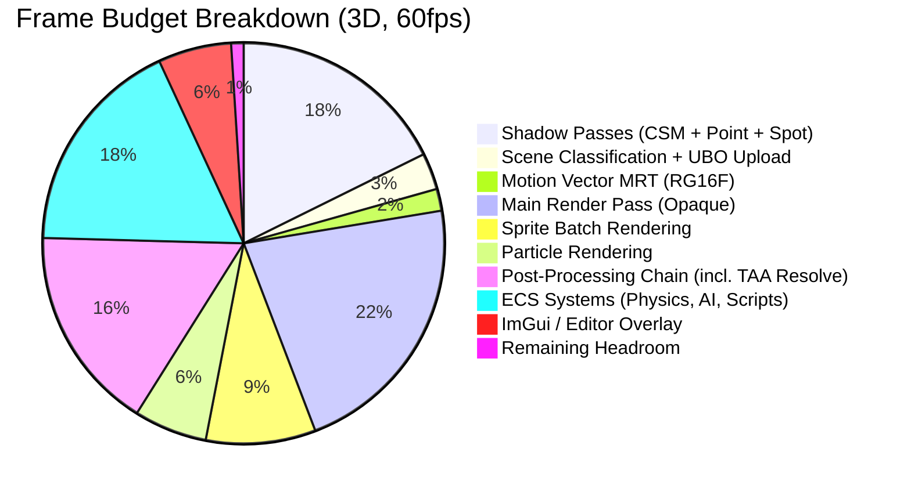

# Enjin Engine -- Comprehensive Technical Analysis

*Analysis Date: 2026-03-16*
*Engine Version: Beta 0.8 (Active Development)*
*Language: C++20 | Graphics API: Vulkan | Build System: CMake*

---

## Table of Contents

1. [System Architecture Diagram](#1-system-architecture-diagram)
2. [Feature Completeness Matrix](#2-feature-completeness-matrix)
3. [Engine Evolution Timeline](#3-engine-evolution-timeline)
4. [Rendering Pipeline Flowchart](#4-rendering-pipeline-flowchart)
5. [Market Positioning Analysis](#5-market-positioning-analysis)
6. [Revenue Model Analysis](#6-revenue-model-analysis)
7. [Market Share Potential](#7-market-share-potential)
8. [Performance Diagnostics Summary](#8-performance-diagnostics-summary)
9. [Technical Debt Assessment](#9-technical-debt-assessment)
10. [Feature Dependency Graph](#10-feature-dependency-graph)
11. [Rendering Pipeline Roadmap](#11-rendering-pipeline-roadmap)

---

## 1. System Architecture Diagram

The Enjin engine is organized in a strict layered architecture. The **Core** layer has zero engine dependencies, the **Engine** layer builds on Core, and the **Application** layer (Editor, Player) consumes Engine. All inter-system communication flows through well-defined interfaces.

```mermaid
graph TB
    subgraph ApplicationLayer["Application Layer"]
        Editor["Editor App<br/>(EditorLayer, ImGui)"]
        Player["Player App<br/>(Standalone Runtime)"]
        Hub["Hub App<br/>(Project Launcher)"]
    end

    subgraph EditorSystems["Editor Systems"]
        PlayMode["PlayMode<br/>(Play/Pause/Stop)"]
        PlayModeDiff["PlayModeDiff<br/>(Cherry-pick Changes)"]
        ScenePicker["ScenePicker<br/>(Ray Cast Selection)"]
        Gizmos["ImGuizmo<br/>(Transform Gizmos)"]
        TemplateSystem["Template System<br/>(44 Templates + Creator<br/>+ Marketplace)"]
        InspectorUndo["Inspector Undo/Redo<br/>(PropertyEditCommand)"]
        Panels["32 Editor Panels<br/>(Hierarchy, Inspector,<br/>Console, Asset Browser...)"]
        Notifications["Toast Notifications<br/>(4 Types, Slide-in)"]
        CommandPalette["Command Palette<br/>(Ctrl+P, Fuzzy Search)"]
    end

    subgraph RendererLayer["Renderer"]
        VulkanContext["VulkanContext<br/>(Instance, Device, Queues)"]
        VulkanRenderer["VulkanRenderer<br/>(Swapchain, Frame Sync)"]
        VulkanPipeline["VulkanPipeline<br/>(Graphics Pipeline,<br/>Descriptor Sets)"]
        VulkanBuffer["VulkanBuffer<br/>(Vertex, Index, Uniform,<br/>Storage Buffers)"]
        RenderSystem["RenderSystem<br/>(Entity Rendering,<br/>Material Sort, Caching,<br/>GPU HiZ Culling,<br/>Clustered Lighting)"]
        PostProcessing["PostProcessing<br/>(Bloom, Vignette, FXAA, TAA,<br/>DoF, Tilt-Shift, Film Grain,<br/>Color Grading, Stipple/Dither,<br/>SSAO, God Rays, Contact<br/>Shadows, Caustics, Fog Shafts)"]
        ShadowSystem["Shadow System<br/>(4-Cascade CSM, Point<br/>Cubemap, Spot 2D Array)"]
        SpriteBatch["SpriteBatchRenderer<br/>(GPU Instanced)"]
        SpriteAtlas["SpriteTextureAtlas<br/>(4096x4096 Shelf-Pack)"]
        ParticleRenderer["ParticleRenderer<br/>(GPU Instanced Billboards,<br/>16384 Particles)"]
        RetroEffects["RetroEffects<br/>(CRT, Pixelation, Dither)"]
        Skybox["Skybox<br/>(Cubemap, Procedural,<br/>Solid Color)"]

        subgraph RayTracing["Ray Tracing Pipeline"]
            RTCapabilities["RTCapabilities<br/>(Extension Detection)"]
            AccelStructures["AccelerationStructureManager<br/>(BLAS Cache, TLAS Rebuild)"]
            RTPipeline["RTPipeline<br/>(SBT Construction)"]
            RTShadows["RTShadows (R16F)"]
            RTReflections["RTReflections (RGBA16F)"]
            RTAO["RTAO (R16F)"]
            RTGI["RTGI (RGBA16F)"]
            MotionVectors["MotionVectors<br/>(RG16F MRT, Binding 4)"]
            MaterialSSBO["Material SSBO<br/>(Hit Shader, Binding 9)"]
            PathTracer["PathTracer<br/>(Progressive Accumulation)"]
            SVGFDenoiser["SVGFDenoiser<br/>(3-Pass Compute)"]
            OIDNDenoiser["OIDNDenoiser<br/>(Intel Neural Denoise)"]
            OptiXDenoiser["OptiXDenoiser<br/>(CUDA Interop)"]
            RTCompositor["RTCompositor<br/>(Fullscreen Compute)"]
        end

        subgraph AdvancedRendering["Advanced Rendering"]
            SHProbes["SH Light Probes<br/>(L2, Grid Baking)"]
            SDFScene["SDF Scene<br/>(6 Primitives, 6 Ops)"]
            OIT["OIT<br/>(Weighted Blended)"]
            CelShading["Cel Shading<br/>(Band Quantization,<br/>Sobel + Geometry Outlines)"]
            VXGI["Voxel Cone Tracing<br/>(Diffuse/Specular GI)"]
            NonEuclidean["Non-Euclidean Geometry<br/>(Portal, Hyperbolic,<br/>Spherical, Toroidal)"]
            Metaballs["Metaball Rendering<br/>(Marching Cubes)"]
            ClusteredLighting["Clustered Forward Lighting<br/>(16x9x24 Grid,<br/>1024 Max Lights)"]
            GPUCulling["GPU Two-Phase HiZ<br/>Occlusion Culling"]
        end

        subgraph OptionalPipelines["Optional Pipelines (CMake Flags)"]
            VRS["Variable Rate Shading<br/>(VK_KHR_fragment_shading_rate)"]
            VirtualTex["Virtual Texturing<br/>(Page-Based Streaming,<br/>Feedback Buffer)"]
            VisibilityBuf["Visibility Buffer<br/>(Deferred Material Resolve)"]
        end
    end

    subgraph ECSLayer["ECS Architecture"]
        World["ECS::World<br/>(Thread-Safe, Deferred<br/>Destroy, Name Cache)"]
        Entity["ECS::Entity (u64 ID)"]
        Components["70+ Component Types"]

        subgraph ComponentCategories["Component Categories"]
            CoreComponents["Core: Transform, Mesh,<br/>Material, Light, Camera,<br/>Name, Notes"]
            PhysicsComponents["Physics: Rigidbody,<br/>Box/Sphere/Capsule Collider,<br/>6 Joint Types, Ragdoll"]
            GameplayComponents["Gameplay: Health, Damage,<br/>Inventory, SaveData,<br/>Quest, HUD, Cinematic"]
            VisualComponents["Visual: Sprite2D, Tilemap,<br/>ParticleEmitter, Billboard,<br/>AnimatedSprite2D"]
            ControllerComponents["Controllers: Platformer2D,<br/>TopDown2D/3D, FPS, TPS,<br/>Vehicle"]
            AIComponents["AI: AIController,<br/>BehaviorTree, Waypoint,<br/>FollowTarget, LookAtTarget"]
            NetworkComponents["Network: NetworkIdentity,<br/>NetworkTransform"]
        end

        subgraph Systems["ECS Systems"]
            ControllerSystem["ControllerSystem<br/>(6 Controller Types)"]
            AISystem["AISystem<br/>(Patrol/Chase/Flee/<br/>Wander/Navmesh)"]
        end
    end

    subgraph PhysicsLayer["Physics"]
        IPhysicsBackend["IPhysicsBackend<br/>(Abstract 3D Interface)"]
        IPhysicsBackend2D["IPhysicsBackend2D<br/>(Abstract 2D Interface)"]
        JoltBackend["JoltBackend<br/>(Jolt v5.2.0, Multi-threaded,<br/>CCD, 6 Joint Types)"]
        Box2DBackend["Box2DBackend<br/>(Box2D v3.0.0, Sub-stepping,<br/>5 Joint Types, CCD)"]
        PhysicsFactory["PhysicsBackendFactory<br/>(Auto/Jolt/Box2D)"]
        SpatialHash["SpatialHashGrid<br/>(Broad-Phase O(N) vs O(N^2))"]
    end

    subgraph AudioLayer["Audio"]
        SimpleAudio["SimpleAudio<br/>(miniaudio Backend)"]
        SteamAudio["SteamAudioProcessor<br/>(HRTF Binaural Rendering,<br/>Occlusion + Transmission,<br/>Geometry-Aware 3D)"]
        Audio3D["3D Spatialization"]
        AudioMixing["Multi-Channel Mixing"]
        MIDIInput["MIDI Input<br/>(WinMM, 12 AS Bindings)"]
        AudioEventGraph["Audio Event Graph<br/>(Runtime Execution,<br/>.enjaudiopkg)"]
    end

    subgraph ScriptingLayer["Scripting"]
        AngelScript["AngelScript Engine<br/>(~844 Bindings,<br/>Hot-Reload)"]
        TegeBehavior["TegeBehavior<br/>(Base Script Class)"]
        VisualScript["Visual Scripting<br/>(222+ Nodes, Debugger,<br/>Profiler)"]
        StateMachine["State Machines<br/>(Script Callbacks)"]
        Coroutines["Coroutines<br/>(Yield/Resume)"]
        EventBus["EventBus<br/>(Pub/Sub Events)"]
        FlashShim["Flash API Shim<br/>(~40 Bindings,<br/>AS2/AS3 Transpiler)"]
        DataAssets["DataAsset System<br/>(Schemas + Instances)"]
    end

    subgraph EffectsLayer["Effects & Procedural"]
        Weather["WeatherSystem<br/>(Rain, Snow, Fog, Storm)"]
        Water3D["Water3D<br/>(Gerstner Waves)"]
        InteractiveWater["Interactive Water<br/>(Spring-Damper, Buoyancy)"]
        ParticleSystem["ParticleSystem<br/>(CPU Sim, 5 Shapes,<br/>12 Presets)"]
        FluidSim["Fluid Simulation<br/>(Stable Fluids, 5 Presets)"]
        FluidTerrain["FluidTerrainCoupling<br/>(Erosion + Accumulate)"]
        ReactionDiffusion["Reaction-Diffusion<br/>(Gray-Scott, 9 Presets)"]
        CellularAutomata["CA Geometry<br/>(7 Rules, 3 Mesh Modes)"]
        Physarum["Physarum Simulation<br/>(50K+ Agents)"]
        FourierMesh["Fourier Mesh<br/>(DFT, 3D Extrusion)"]
        Projection4D["4D Projection<br/>(5 Polytopes)"]
        WindSystem["Wind System"]
        WorldTime["World Time / Seasons"]

        subgraph ProceduralGen["Procedural Generation"]
            CellularAutomataGen["Cellular Automata<br/>(Cave Gen)"]
            BSP["BSP<br/>(Room-Corridor Dungeons)"]
            DiamondSquare["Diamond-Square<br/>(Heightmap Terrain)"]
            LSystem["L-System<br/>(3D Stochastic Rules)"]
            WFC["Wave Function Collapse<br/>(Tile-Based)"]
            Voronoi["Voronoi<br/>(3 Distance Metrics)"]
            RandomWalker["Random Walker"]
            Grammar["Grammar Rules"]
            PrefabAssembler["Prefab Assembler<br/>(Snap-Together Rooms)"]
            FractalTerrain["Fractal Terrain<br/>(fBm, Erosion)"]
        end
    end

    subgraph NetworkingLayer["Networking"]
        LANMultiplayer["LAN Multiplayer<br/>(Host-Authoritative UDP)"]
        NetworkSecurity["Network Security<br/>(HMAC-SHA256, Replay<br/>Protection)"]
        HTTPClient["HTTP Client<br/>(WinHTTP + libcurl)"]
        NewgroundsAPI["Newgrounds.io API<br/>(Medals, Scores, Cloud)"]
        SteamBackend["Steam Save Backend<br/>(ENJIN_STEAM)"]
    end

    subgraph GUILayer["GUI / UI System"]
        UICanvas["UICanvasComponent<br/>(Element Tree, Themes)"]
        UISystem["UISystem<br/>(Layout, Render, Input,<br/>Focus Navigation)"]
        UIWidgets["8 Widget Types<br/>(Panel, Button, Label,<br/>Image, Progress, Slider,<br/>Checkbox, Toggle)"]
        NineSlice["Nine-Slice Sprites"]
        DialogueBox["DialogueBoxComponent<br/>(Auto-Build UI)"]
        FocusNav["Focus Navigation<br/>(Tab/DPad/Arrow, WCAG)"]
    end

    subgraph AccessibilityLayer["Accessibility"]
        ColorblindFilter["Colorblind Filter<br/>(8 Modes + Safe Palettes)"]
        SubtitleSystem["Subtitle System"]
        ContentWarning["Content Warning System"]
        ReducedMotion["Reduced Motion"]
        ScreenReader["Screen Reader Announcer"]
        SwitchAccess["Switch Access<br/>(One-Button Scanning)"]
        DwellClick["Dwell-Click / Sticky Drag"]
        AltInput["Alternative Input<br/>(Eye Tracking, Head<br/>Tracking, Sip-and-Puff)"]
        HighContrast["High Contrast Themes<br/>(WCAG AAA 7:1+)"]
        FontScaling["Font Scaling /<br/>Dyslexia Mode"]
    end

    subgraph BuildLayer["Build & Assets"]
        BuildPipeline["BuildPipeline<br/>(Scan, Validate, Pack,<br/>NSIS Installer, CPack)"]
        AssetPacker["AssetPacker<br/>(.enjpak, CRC32, XOR)"]
        GLTFLoader["GLTFLoader<br/>(Native glTF/GLB)"]
        AssimpLoader["AssimpLoader<br/>(FBX/OBJ/DAE/PLY/VOX)"]
        SceneImporter["SceneImporter<br/>(Auto-Detect Format)"]
        PrefabManager["PrefabManager<br/>(.enjprefab)"]
        HTML5Export["HTML5 Export<br/>(Canvas, Preloader,<br/>Newgrounds Template)"]
        SceneSerializer["SceneSerializer<br/>(JSON)"]
        LevelStreaming["Level Streaming<br/>(StreamingVolume/Portal)"]
    end

    subgraph ToolsLayer["Graph Editors & Tools"]
        ShaderGraph["Shader Graph<br/>(62 Nodes, GLSL Codegen,<br/>.enjshader)"]
        ParticleGraph["Particle Graph<br/>(Compiler to Emitter,<br/>.enjparticle)"]
        DialogueEditor["Dialogue Editor<br/>(7 Node Types, .enjdlg)"]
        BehaviorTreeEditor["Behavior Tree Editor<br/>(20 Node Types)"]
        QuestFlowEditor["Quest Flow Editor"]
        TimelineEditor["Timeline Editor<br/>(Flash-Style, Keyframes)"]
        PixelEditor["Pixel Editor<br/>(8 Tools, 9 Retro Presets)"]
        VectorDrawing["Vector Drawing Editor<br/>(7 Shapes, SVG Export)"]
        Profiler["Profiler<br/>(P50/P95/P99, CSV Export)"]
        PluginSystem["Plugin System<br/>(Hot-Reload, PluginSDK.h)"]
    end

    subgraph CoreLayer["Core Layer (No Engine Dependencies)"]
        Application["Application"]
        Window["Window (GLFW)"]
        Input["Input System"]
        MathLib["Math Library<br/>(Vector, Matrix, Quaternion,<br/>Spline, Noise)"]
        Memory["Memory Allocators<br/>(Stack, Pool, Linear,<br/>Frame)"]
        Logging["Logging<br/>(Thread-Safe, Categorized)"]
        Platform["Platform Abstraction<br/>(PlatformTarget)"]
        Types["Type Aliases<br/>(u8-u64, i8-i64, f32/f64)"]
    end

    %% Application -> Editor Systems
    Editor --> PlayMode
    Editor --> Panels
    Editor --> ScenePicker
    Editor --> Gizmos
    Editor --> TemplateSystem
    Editor --> Notifications
    Editor --> CommandPalette

    %% Editor -> Engine
    PlayMode --> RenderSystem
    PlayMode --> PhysicsFactory
    PlayMode --> AngelScript
    PlayMode --> VisualScript
    PlayMode --> AISystem
    PlayMode --> SimpleAudio

    %% Player -> Engine
    Player --> RenderSystem
    Player --> PhysicsFactory
    Player --> AngelScript
    Player --> VisualScript
    Player --> ParticleSystem
    Player --> PostProcessing

    %% Renderer connections
    RenderSystem --> VulkanPipeline
    RenderSystem --> VulkanBuffer
    RenderSystem --> ShadowSystem
    RenderSystem --> SpriteBatch
    RenderSystem --> SpriteAtlas
    RenderSystem --> ParticleRenderer
    RenderSystem --> Skybox
    RenderSystem --> SHProbes
    RenderSystem --> ClusteredLighting
    RenderSystem --> GPUCulling
    VulkanContext --> VRS
    VulkanContext --> VirtualTex
    VulkanContext --> VisibilityBuf
    VulkanPipeline --> VulkanContext
    VulkanBuffer --> VulkanContext
    VulkanRenderer --> VulkanContext
    PostProcessing --> VulkanPipeline
    RetroEffects --> PostProcessing

    %% RT connections
    RenderSystem --> AccelStructures
    AccelStructures --> RTPipeline
    RTPipeline --> RTShadows
    RTPipeline --> RTReflections
    RTPipeline --> RTAO
    RTPipeline --> RTGI
    RTPipeline --> PathTracer
    RTShadows --> SVGFDenoiser
    RTReflections --> SVGFDenoiser
    RTAO --> SVGFDenoiser
    RTGI --> SVGFDenoiser
    SVGFDenoiser --> RTCompositor
    OIDNDenoiser --> RTCompositor

    %% Physics (SimplePhysics removed Feb 2026)
    PhysicsFactory --> JoltBackend
    PhysicsFactory --> Box2DBackend
    JoltBackend --> IPhysicsBackend
    Box2DBackend --> IPhysicsBackend2D
    ControllerSystem --> IPhysicsBackend
    ControllerSystem --> IPhysicsBackend2D

    %% ECS
    World --> Entity
    World --> Components
    RenderSystem --> World
    ControllerSystem --> World
    AISystem --> World

    %% Scripting
    AngelScript --> TegeBehavior
    AngelScript --> World
    AngelScript --> SimpleAudio
    VisualScript --> World
    VisualScript --> IPhysicsBackend

    %% Build
    BuildPipeline --> AssetPacker
    BuildPipeline --> SceneSerializer
    SceneImporter --> GLTFLoader
    SceneImporter --> AssimpLoader

    %% Core dependencies
    RenderSystem --> MathLib
    World --> Memory
    Application --> Window
    Window --> Input
    Application --> Logging
    Application --> Platform
```



### Architectural Highlights

- **Strict layering**: Core has zero Engine dependencies. Engine never references Editor or Player.
- **Physics abstraction**: `IPhysicsBackend` / `IPhysicsBackend2D` interfaces allow swapping Jolt or Box2D at runtime via `PhysicsBackendFactory`. The legacy SimplePhysics backend was removed entirely in Feb 2026, eliminating technical debt.
- **Thread safety**: ECS World uses recursive mutex for structural operations; entity destruction is deferred and flushed at frame start. O(1) entity validation via `unordered_set` (Feb 2026 ECS audit).
- **Spatial audio pipeline**: Steam Audio HRTF binaural rendering with geometry-aware occlusion and transmission, layered on top of the miniaudio backend.
- **Hardened codebase**: 10+ audit rounds, 205+ findings fixed across Vulkan renderer, ECS, serialization, physics, and scripting subsystems. All VkResult calls checked; null guards on all physics/audio paths.
- **Test infrastructure**: 55 test executables (51 unit + 4 integration) organized into `Tests/Unit/` and `Tests/Integration/` with a shared `EnjinTest.h` framework.

---

## 2. Feature Completeness Matrix

This matrix compares Enjin's current feature set against five established game engines. Ratings are based on the depth and production-readiness of each feature area.

**Rating Key:**
- **Full** -- Feature-complete, production-ready, comparable to or exceeding competitors
- **Partial** -- Functional but missing some capabilities vs. competitors
- **Basic** -- Implemented but limited scope
- **Stub** -- Interface exists, minimal implementation
- **None** -- Not present

| Category | Enjin | Unity | Godot | Unreal | GameMaker | Construct |
|---|---|---|---|---|---|---|
| **2D Rendering** | Full | Full | Full | Full | Full | Full |
| **3D Rendering** | Full | Full | Partial | Full | None | None |
| **PBR Materials** | Full | Full | Full | Full | None | None |
| **Ray Tracing** | Full | Full | None | Full | None | None |
| **Post-Processing** | Full | Full | Full | Full | Basic | Basic |
| **Anti-Aliasing (FXAA/TAA)** | Full | Full | Full | Full | None | None |
| **Upscaling (DLSS/FSR/XeSS)** | Stub | Full | None | Full | None | None |
| **Shadows (CSM/Point/Spot)** | Full | Full | Full | Full | None | None |
| **Sprite Batching/Atlas** | Full | Full | Full | Partial | Full | Full |
| **Skeletal Animation** | Full | Full | Full | Full | Basic | None |
| **Sprite Animation** | Full | Full | Full | Partial | Full | Full |
| **3D Physics (Production)** | Full | Full | Full | Full | None | None |
| **2D Physics (Production)** | Full | Full | Full | Partial | Basic | Basic |
| **Physics Joints** | Full | Full | Full | Full | None | None |
| **Audio Engine** | Full | Full | Full | Full | Full | Full |
| **3D Spatial Audio** | Full | Full | Full | Full | None | None |
| **MIDI Input** | Basic | Partial | None | None | None | None |
| **Text Scripting** | Full | Full | Full | Full | Full | None |
| **Visual Scripting** | Full | Partial | Full | Full | Partial | Full |
| **Hot-Reload** | Full | Full | Partial | Full | N/A | N/A |
| **State Machines** | Full | Partial | Partial | Full | None | None |
| **Editor (GUI)** | Full | Full | Full | Full | Full | Full |
| **Scene Hierarchy** | Full | Full | Full | Full | Basic | Basic |
| **Inspector/Properties** | Full | Full | Full | Full | Partial | Partial |
| **Undo/Redo** | Full | Full | Full | Full | Full | Full |
| **Multi-Select** | Full | Full | Full | Full | Partial | Partial |
| **Transform Gizmos** | Full | Full | Full | Full | None | None |
| **Asset Browser** | Full | Full | Full | Full | Partial | Partial |
| **Tilemap Editing** | Full | Full | Full | None | Full | Full |
| **Terrain Sculpting** | Partial | Full | Partial | Full | None | None |
| **Prefab System** | Full | Full | Full | Full | None | None |
| **Build/Export Pipeline** | Full | Full | Full | Full | Full | Full |
| **HTML5 Export** | Full | Partial | Full | None | Full | Full |
| **Console Support** | Stub | Full | Partial | Full | Full | Partial |
| **Mobile Support** | None | Full | Full | Full | Full | Full |
| **LAN Multiplayer** | Full | Partial | Partial | Full | Basic | Partial |
| **HTTP/REST Client** | Full | Full | Partial | Full | Full | Full |
| **Save System** | Full | Basic | Basic | Partial | Basic | Basic |
| **Quest System** | Full | None | None | None | None | None |
| **Dialogue Trees** | Full | None | None | None | None | None |
| **AI / Behavior Trees** | Full | None | None | Full | None | None |
| **Navmesh / Pathfinding** | Full | Full | Full | Full | Basic | Partial |
| **UI System (Runtime)** | Full | Full | Partial | Full | Basic | Full |
| **Accessibility** | Full | Partial | Partial | Partial | None | Basic |
| **Procedural Generation** | Full | None | None | Partial | None | None |
| **Weather System** | Full | None | None | None | None | None |
| **Particle System** | Full | Full | Full | Full | Full | Partial |
| **Shader Graph** | Full | Full | Full | Full | None | None |
| **Plugin/Extension System** | Full | Full | Full | Full | Partial | Partial |
| **Profiler** | Full | Full | Partial | Full | Basic | None |
| **Localization** | Full | Partial | Full | Full | None | Partial |
| **Level Streaming** | Full | Full | None | Full | None | None |
| **Retro/CRT Effects** | Full | Basic | None | None | None | None |
| **Flash/SWF Import** | Full | None | None | None | None | None |
| **Newgrounds Integration** | Full | None | None | None | None | None |
| **HRTF Binaural Audio** | Full | Partial | None | Full | None | None |
| **Audio Occlusion/Transmission** | Full | Partial | None | Full | None | None |
| **Sprite Normal Map Lighting** | Full | Full | Full | N/A | None | None |
| **Automated Test Suite (55 CTest)** | Full | Full | Partial | Full | None | None |

### Summary by Engine

| Engine | Full | Partial | Basic | Stub | None |
|--------|------|---------|-------|------|------|
| **Enjin** | 54 | 1 | 1 | 2 | 1 |
| **Unity** | 39 | 7 | 2 | 0 | 7 |
| **Godot** | 32 | 10 | 1 | 0 | 12 |
| **Unreal** | 40 | 6 | 0 | 0 | 9 |
| **GameMaker** | 14 | 5 | 9 | 0 | 26 |
| **Construct** | 13 | 9 | 5 | 0 | 27 |

Enjin achieves surprisingly broad feature coverage for a single-developer engine, now including Steam Audio HRTF spatial audio, sprite normal map lighting, and a 55-executable automated test suite. Its main gaps are mobile platform support and console certification (which require licensed devkits and partnership agreements).

---

## 3. Engine Evolution Timeline

This timeline shows the actual development history reconstructed from git commit dates. The entire engine was built in approximately 8 weeks, starting December 23, 2025.

```mermaid
gantt
    title Enjin Engine Development Phases (Actual Git History)
    dateFormat YYYY-MM-DD
    axisFormat %m/%d

    section Foundation (Week 1)
    Project Init & Vulkan Swapchain             :done, f1, 2025-12-23, 2025-12-24
    3D Rendering Pipeline & GPU Culling         :done, f2, 2025-12-24, 2025-12-25
    Core Layer (Types, Math, Platform)          :done, f3, 2025-12-23, 2025-12-25

    section Renderer & Editor (Week 2)
    Shader Compilation & Triangle Fix           :done, r1, 2026-01-22, 2026-01-27
    Engine Infrastructure (Input, glTF, ImGui)  :done, r2, 2026-01-27, 2026-01-28
    Blinn-Phong Lighting & PBR Materials        :done, r3, 2026-01-27, 2026-01-28
    Shadow Mapping (CSM)                        :done, r4, 2026-01-28, 2026-01-28

    section Core Systems (Week 3)
    Post-Processing & Retro Effects             :done, s1, 2026-01-28, 2026-01-30
    Weather, Water, Wind & Vegetation           :done, s2, 2026-01-29, 2026-01-30
    Skeletal Animation (GPU Skinning)           :done, s3, 2026-01-30, 2026-01-30
    Physics & Collision Detection               :done, s4, 2026-01-30, 2026-01-30
    Parallax & Normal Mapping                   :done, s5, 2026-01-30, 2026-01-30

    section Editor & Audio (Week 4)
    Scene Management & 21 Templates             :done, e1, 2026-01-31, 2026-01-31
    Accessibility, Input Remapping, UI System   :done, e2, 2026-01-31, 2026-01-31
    Skybox, Undo/Redo, IK Solvers, Prefabs     :done, e3, 2026-01-31, 2026-01-31
    Audio (miniaudio Backend)                   :done, e4, 2026-01-31, 2026-01-31
    Build Pipeline & Splitscreen                :done, e5, 2026-02-01, 2026-02-01

    section 2D Pipeline (Week 5)
    Terrain Sculpting                           :done, d1, 2026-02-02, 2026-02-02
    2D Editor Tools (Sprite, Tilemap)           :done, d2, 2026-02-02, 2026-02-02
    Runtime UI System & 2.5D Lit Sprites        :done, d3, 2026-02-02, 2026-02-02
    Particle & Sprite Batch Renderers           :done, d4, 2026-02-02, 2026-02-03
    Collision Filtering (32-group Bitmask)      :done, d5, 2026-02-03, 2026-02-03

    section Scripting & Tools (Week 6)
    Dialogue Trees & State Machines             :done, t1, 2026-02-04, 2026-02-04
    AngelScript Bindings & Shader Hot-Reload    :done, t2, 2026-02-04, 2026-02-04
    Noise Library & Tweening (25 Easings)       :done, t3, 2026-02-04, 2026-02-04
    29 Enhanced Templates & 2D/3D Mode          :done, t4, 2026-02-04, 2026-02-05
    9-Slice, Asset Metadata, 2D Camera          :done, t5, 2026-02-05, 2026-02-05

    section Visual Scripting & Perf (Week 7)
    Visual Scripting (Phases 1-4)               :done, v1, 2026-02-06, 2026-02-06
    Shadow Optimization & Descriptor Caching    :done, v2, 2026-02-06, 2026-02-08
    Soft Shadows, Point/Spot Shadow Maps        :done, v3, 2026-02-07, 2026-02-08
    Sprite Texture Atlas (4096x4096)            :done, v4, 2026-02-08, 2026-02-08
    Fence-Based GPU Sync (18 Subsystems)        :done, v5, 2026-02-07, 2026-02-07

    section Massive Expansion (Week 8)
    AI/BT, 2D Physics, Proc Gen, Destructibles :done, m1, 2026-02-09, 2026-02-09
    Localization, Fluid Sim, Pixel Editor       :done, m2, 2026-02-09, 2026-02-09
    SVG, Empty States, Dialogue Box, Icons      :done, m3, 2026-02-09, 2026-02-09
    RT Pipeline, Collaborative Editing          :done, m4, 2026-02-10, 2026-02-10
    Newgrounds API, HTML5 Export, Vector Editor  :done, m5, 2026-02-10, 2026-02-10
    Cel Shading, Save System, PlayMode Diff     :done, m6, 2026-02-10, 2026-02-10

    section Physics & Platform (Week 9)
    IPhysicsBackend + Jolt v5.2.0 Backend       :done, p1, 2026-02-11, 2026-02-11
    Box2D v3.0.0 Backend                        :done, p2, 2026-02-11, 2026-02-11
    Template Redesign (38 → 22 → 43)            :done, p3, 2026-02-12, 2026-02-13
    Stipple/Dither, Camera Presets, DoF         :done, p4, 2026-02-12, 2026-02-12
    OIT, SH Probes, SDF Scene, POM Modes        :done, p5, 2026-02-13, 2026-02-13
    Physics Phase 4-5 (Jolt/Box2D Default)      :done, p6, 2026-02-13, 2026-02-13

    section Advanced & Exotic (Week 10)
    Linux/Steam Deck, Switch Stub, Hub App      :done, a1, 2026-02-14, 2026-02-14
    9 Exotic Rendering Systems                  :done, a2, 2026-02-14, 2026-02-14
    Shader/Audio/Particle Graphs, MIDI Input    :done, a3, 2026-02-14, 2026-02-14
    Symbol Library, Newgrounds Game Page         :done, a4, 2026-02-14, 2026-02-14
    Template Marketplace, Gamepad Editor         :done, a5, 2026-02-14, 2026-02-14

    section Polish & Audits (Week 11)
    Audio Rewrite (miniaudio), Audio Mixer      :done, q1, 2026-02-15, 2026-02-15
    Post-Process Volumes, Screen-Space Effects  :done, q2, 2026-02-15, 2026-02-15
    InputAction System, NSIS Installer          :done, q3, 2026-02-16, 2026-02-16
    Networking Security (HMAC-SHA256)           :done, q4, 2026-02-16, 2026-02-17
    5+ Security/Stability Audit Rounds          :done, q5, 2026-02-11, 2026-02-17

    section Hardening & Audio (Week 12)
    SimplePhysics Legacy Backend Removed        :done, h1, 2026-02-18, 2026-02-18
    Steam Audio HRTF Phase 1 (Binaural)         :done, h2, 2026-02-18, 2026-02-18
    Steam Audio Phase 2 (Occlusion/Transmission):done, h3, 2026-02-18, 2026-02-18
    ECS Tier 1 Audit (O(1) Validation, 40 Tests):done, h4, 2026-02-17, 2026-02-17
    Vulkan Renderer Hardening (VkResult/Leaks)  :done, h5, 2026-02-17, 2026-02-18
    80+ Medium-Severity Audit Fixes (23 Files)  :done, h6, 2026-02-17, 2026-02-18
    42 More Audit Fixes (Physics/Script/Scene)  :done, h7, 2026-02-18, 2026-02-18
    Serialization & Asset Pack Hardening        :done, h8, 2026-02-18, 2026-02-18
    6 New Test Suites (Physics2D, VS, BT, UI, Net, Fuzz) :done, h9, 2026-02-17, 2026-02-17
    3 More Test Suites + Unit/Integration Reorg :done, h10, 2026-02-19, 2026-02-19
    MaturityTier Badges (Hub + Marketplace)     :done, h11, 2026-02-19, 2026-02-19
    Sprite Normal Map Lighting + Drop Shadows   :done, h12, 2026-02-18, 2026-02-18
    CSM Cascade Blending + Tether Rework        :done, h13, 2026-02-18, 2026-02-18
    Player Auto Title Screen + Pause Menu       :done, h14, 2026-02-18, 2026-02-18
    Editor Viewport Camera/Gizmos in Play Mode  :done, h15, 2026-02-18, 2026-02-18

    section Beta 0.8 (Weeks 13-14)
    Clustered Forward Lighting (16x9x24)        :done, b1, 2026-02-20, 2026-03-07
    GPU Two-Phase HiZ Occlusion Culling         :done, b2, 2026-02-20, 2026-03-07
    Variable Rate Shading (VK_KHR_fragment_shading_rate) :done, b3, 2026-02-20, 2026-03-07
    Virtual Texturing (Page-Based Streaming)    :done, b4, 2026-02-20, 2026-03-07
    Visibility Buffer (Deferred Material Resolve) :done, b5, 2026-02-20, 2026-03-07
    LOD Hysteresis + Screen-Space Sizing        :done, b6, 2026-02-20, 2026-03-07
    Material Enhancements (Transmission/SSS/64-bit Sort Keys) :done, b7, 2026-02-20, 2026-03-07
    FrameAllocator (Per-Frame Linear Allocator) :done, b8, 2026-02-20, 2026-03-07
    Elemental System (Dot-Product Particles)    :done, b9, 2026-03-07, 2026-03-08
    29 Additional Unit Test Suites (26 -> 55)   :done, b10, 2026-02-20, 2026-03-08

    section RT & AA Hardening (Weeks 15-16)
    Motion Vectors + TAA (Phase 1)              :done, rt1, 2026-03-11, 2026-03-14
    RT Material SSBO + OptiX Interop (Phase 2)  :done, rt2, 2026-03-14, 2026-03-16

    section Planned
    macOS (MoltenVK)                            :active, pl1, 2026-03-01, 2026-06-01
    Console Platforms                           :active, pl2, 2026-06-01, 2027-06-01
    Mobile (Android/iOS)                        :active, pl3, 2026-09-01, 2027-03-01
    VR/XR (OpenXR)                              :active, pl4, 2027-01-01, 2027-06-01
```



**Note:** There is a ~4-week gap between the initial Dec 23-25, 2025 foundation commits and the resumption of active development on Jan 22, 2026. The bulk of the engine (150+ features) was built in the subsequent 4 weeks (Jan 22 - Feb 17, 2026). Week 12 (Feb 17-19) focused on hardening: 120+ audit findings fixed, SimplePhysics removed, Steam Audio integrated, and test coverage expanded from 8 to 55 executables.

---

## 4. Rendering Pipeline Flowchart

This diagram details the complete rendering pipeline for a single frame, including the 2D/2.5D/3D branching logic.

```mermaid
flowchart TB
    FrameStart["Frame Start<br/>(VulkanRenderer::BeginFrame)"] --> FlushDestroy["Flush Deferred<br/>Entity Destruction"]
    FlushDestroy --> UpdateSystems["Update ECS Systems<br/>(Controllers, Physics,<br/>Scripts, AI)"]
    UpdateSystems --> ClassifyScene["ClassifySceneComposition()"]

    ClassifyScene --> Is2D{Scene Type?}

    Is2D -->|Scene2D<br/>"Sprites/Tilemaps Only"| Path2D["2D Fast Path"]
    Is2D -->|Scene2_5D<br/>"Sprites + Lights"| Path25D["2.5D Path"]
    Is2D -->|Scene3D<br/>"3D Meshes Present"| Path3D["3D Full Path"]

    subgraph Path2DBlock["2D Pipeline"]
        Path2D --> SkipShadows2D["Skip ALL Shadow Passes"]
        SkipShadows2D --> MinimalUBO["Upload Minimal LightingUBO<br/>(Ambient + Fog Only)"]
        MinimalUBO --> SkipNormalMap["Skip Normal Map<br/>Descriptor Writes"]
    end

    subgraph Path25DBlock["2.5D Pipeline"]
        Path25D --> SkipShadows25D["Skip Shadow Passes"]
        SkipShadows25D --> FullLightingUBO["Upload Full LightingUBO<br/>(Lights for Lit Sprites)"]
        FullLightingUBO --> BindNormalMap25D["Bind Normal Map<br/>Descriptors"]
    end

    subgraph Path3DBlock["3D Full Pipeline"]
        Path3D --> ShadowCasterCache["Build Shadow Caster<br/>Cache (Pre-filtered)"]

        ShadowCasterCache --> DirShadow["Directional Light<br/>Shadow Pass"]
        subgraph CSMCascades["4-Cascade CSM"]
            DirShadow --> C0["Cascade 0<br/>(Near)"]
            DirShadow --> C1["Cascade 1"]
            DirShadow --> C2["Cascade 2"]
            DirShadow --> C3["Cascade 3<br/>(Far)"]
        end

        ShadowCasterCache --> PointShadow["Point Light Shadows<br/>(Up to 4 Cubemaps,<br/>512^2 per face)"]
        ShadowCasterCache --> SpotShadow["Spot Light Shadows<br/>(Up to 4, 2D Array,<br/>1024^2)"]

        C3 --> FullUBO3D["Upload Full LightingUBO<br/>(Multi-Light Arrays,<br/>Shadow Data, SH Probes)"]
        PointShadow --> FullUBO3D
        SpotShadow --> FullUBO3D
        FullUBO3D --> BindNormalMap3D["Bind Normal Map<br/>Descriptors"]

        BindNormalMap3D --> RTCheck{RT Hardware<br/>Available?}
        RTCheck -->|Yes| RTPipelineExec["Ray Tracing Pipeline"]

        subgraph RayTracingBlock["Ray Tracing (Scene3D Only)"]
            RTPipelineExec --> BuildTLAS["Rebuild TLAS<br/>(Per-Frame)"]
            BuildTLAS --> DispatchRT["Dispatch RT Effects"]
            DispatchRT --> RTShadowsD["RT Shadows<br/>(1 SPP)"]
            DispatchRT --> RTReflectD["RT Reflections<br/>(Specular)"]
            DispatchRT --> RTAOD["RT AO<br/>(Hemisphere)"]
            DispatchRT --> RTGID["RT GI<br/>(Multi-Bounce)"]
            RTShadowsD --> Denoise["Denoise<br/>(SVGF or OIDN)"]
            RTReflectD --> Denoise
            RTAOD --> Denoise
            RTGID --> Denoise
            Denoise --> Composite["RT Compositor<br/>(Fullscreen Compute)"]
        end

        RTCheck -->|No| SkipRT["Skip RT"]
    end

    SkipNormalMap --> MainPass
    BindNormalMap25D --> MainPass
    BindNormalMap3D --> MainPass
    Composite --> MainPass
    SkipRT --> MainPass

    subgraph MainRenderPass["Main Render Pass"]
        MainPass["Begin Render Pass"] --> SkyboxR["Render Skybox<br/>(if type != None)"]
        SkyboxR --> SortEntities["Sort Entities by<br/>cachedTextureKey<br/>(Material Sort)"]
        SortEntities --> LODSelect["LOD Selection<br/>(Screen-Space Size,<br/>Hysteresis)"]
        LODSelect --> GPUCull["GPU Two-Phase HiZ<br/>Occlusion Culling"]
        GPUCull --> ClusterAssign["Clustered Light<br/>Assignment (Compute)"]
        ClusterAssign --> OpaquePass["Opaque Pass"]

        subgraph OpaqueLoop["Per-Entity Rendering"]
            OpaquePass --> CheckVisible{entity.visible?}
            CheckVisible -->|No| SkipEntity["Skip"]
            CheckVisible -->|Yes| PushConstants["Upload Push Constants<br/>(128 bytes: Model Matrix,<br/>Material Props, Flags)"]
            PushConstants --> DescCache{"Descriptor<br/>Cache Hit?"}
            DescCache -->|Yes| SkipDescWrite["Skip Descriptor Write"]
            DescCache -->|No| UpdateDesc["Update Descriptors<br/>(Bindings 3/5/6/7)"]
            SkipDescWrite --> DrawCall["vkCmdDrawIndexed"]
            UpdateDesc --> DrawCall
        end

        DrawCall --> OITCheck{OIT Entities<br/>Present?}
        OITCheck -->|Yes| OITPass["OIT Weighted Blended<br/>Pass + Composite"]
        OITCheck -->|No| SkipOIT["Skip OIT"]

        OITPass --> SpritePass
        SkipOIT --> SpritePass

        SpritePass["Sprite Batch Rendering"] --> AtlasCheck{"Atlas<br/>Sprites?"}
        AtlasCheck -->|Yes| AtlasBatch["Single Instanced Draw<br/>(Atlas Texture)"]
        AtlasCheck -->|No| IndividualDraw["Individual Draws<br/>(Oversized/Excluded)"]

        AtlasBatch --> ParticlePass
        IndividualDraw --> ParticlePass

        ParticlePass["Particle Rendering<br/>(GPU Instanced Billboards)"]
        ParticlePass --> VegetationPass["Vegetation Pass<br/>(Grass/Shrub/Tree)"]
        VegetationPass --> WaterPass["Water Rendering<br/>(Gerstner Waves)"]
        WaterPass --> DebugViz["Debug Visualization<br/>(Collider Wireframes,<br/>Joint Lines, SH Probes)"]
    end

    DebugViz --> PostProcess

    subgraph PostProcessBlock["Post-Processing Chain"]
        PostProcess["Post-Processing"] --> Bloom["Bloom<br/>(Threshold + Blur)"]
        Bloom --> SSAO_PP["SSAO<br/>(Multiplicative, HDR)"]
        SSAO_PP --> ContactShadows_PP["Contact Shadows<br/>(Ray March, HDR)"]
        ContactShadows_PP --> Caustics_PP["Fake Caustics<br/>(Additive, HDR)"]
        Caustics_PP --> GodRays_PP["God Rays<br/>(Radial Blur, HDR)"]
        GodRays_PP --> FogShafts_PP["Fog Shafts<br/>(Volumetric, HDR)"]
        FogShafts_PP --> DOF["Depth of Field<br/>(Poisson Disc)"]
        DOF --> TiltShift["Tilt-Shift<br/>(Focus Band Blur)"]
        TiltShift --> CelOutlines["Cel Shading Outlines<br/>(Sobel + Curvature-Driven)"]
        CelOutlines --> StippleDither["Stipple / Dither<br/>(8 Patterns, 3 Color<br/>Modes)"]
        StippleDither --> ColorGrading["Color Grading"]
        ColorGrading --> TAAResolve["TAA Resolve<br/>(Neighborhood Clamping,<br/>Velocity Reprojection)"]
        TAAResolve --> FXAA["FXAA"]
        FXAA --> Vignette["Vignette"]
        Vignette --> FilmGrain["Film Grain"]
        FilmGrain --> RetroFX["Retro Effects<br/>(CRT, Pixelation)"]
    end

    RetroFX --> EditorOverlay

    subgraph EditorOverlayBlock["Editor Overlay (Editor Only)"]
        EditorOverlay["ImGui Overlay"] --> ImGuiPanels["Editor Panels<br/>(Hierarchy, Inspector,<br/>Console, etc.)"]
        ImGuiPanels --> GameView["Game View Viewport<br/>(RenderToTarget)"]
        GameView --> GizmoOverlay["Gizmo Overlay<br/>(ImGuizmo)"]
    end

    GizmoOverlay --> Present["Present<br/>(vkQueuePresentKHR)"]

    style Path2DBlock fill:#1a3a1a,stroke:#4a8a4a
    style Path25DBlock fill:#2a2a3a,stroke:#6a6aaa
    style Path3DBlock fill:#3a1a1a,stroke:#aa4a4a
    style RayTracingBlock fill:#2a1a3a,stroke:#8a4aaa
    style PostProcessBlock fill:#1a2a3a,stroke:#4a7aaa
```

### Key Pipeline Optimizations

1. **Scene Classification Gate**: 2D-only scenes skip shadow passes entirely, saving 4+ render passes per frame.
2. **Material Sort**: Entities sorted by 64-bit `cachedTextureKey` so identical materials draw consecutively, maximizing descriptor cache hits.
3. **Descriptor Caching**: `m_LastBound` tracking skips `vkUpdateDescriptorSets` when texture/bone pointers are unchanged.
4. **Play Mode Skip**: `m_SkipMainPassRendering` flag prevents double-drawing (offscreen Game View + main swapchain).
5. **Shadow Caster Cache**: Pre-filtered list avoids redundant per-cascade entity iteration.
6. **GPU Two-Phase HiZ Occlusion Culling**: Phase 0 culls against previous frame's depth pyramid; partial HiZ regeneration from visible objects; Phase 1 re-tests flagged objects against updated HiZ. Async compute overlap.
7. **Clustered Forward Lighting**: 16x9x24 grid with up to 1024 lights. Light-cluster assignment via compute shader eliminates per-fragment light iteration.
8. **LOD with Hysteresis**: Screen-space projected size selection with dead-zone transitions prevents LOD flickering.
9. **Per-Frame Linear Allocator**: `FrameAllocator` provides O(1) allocation for transient per-frame data, reset each frame.
10. **Variable Rate Shading** (optional, `ENJIN_VRS`): `VK_KHR_fragment_shading_rate` reduces shading rate in low-detail regions.
11. **Virtual Texturing** (optional, `ENJIN_VIRTUAL_TEXTURING`): Page-based streaming with feedback buffer, indirection texture, and physical atlas (bindings 16-17).
12. **Visibility Buffer** (optional, `ENJIN_VISIBILITY_BUFFER`): Deferred material resolve via compute shader, decoupling geometry from shading.

---

## 5. Market Positioning Analysis

### Target Audience

Enjin occupies a unique position in the game engine market by targeting several underserved audiences simultaneously:

| Audience Segment | Why Enjin Appeals | Primary Competitors |
|---|---|---|
| **Indie Developers** | All-in-one 2D+3D with built-in gameplay systems (save, quest, dialogue, AI) that competitors require plugins for. Hardened codebase with 55 test suites builds production confidence | Unity, Godot |
| **Flash Game Creators** | SWF import, AS2/AS3 transpiler, Newgrounds.io API, HTML5 export, Flash-style timeline editor -- no other engine offers this combination | None (Enjin is unique) |
| **Retro Game Makers** | CRT effects, pixel editor, 9 retro resolution presets, dithered gradients, stipple patterns, sprite sheet workflow | GameMaker, Pico-8 |
| **Students & Educators** | Built-in behavior trees, visual scripting, procedural generation, and comprehensive accessibility -- strong teaching tool | Godot, Scratch |
| **Accessibility-First Developers** | 8 colorblind modes, screen reader, switch access, dwell-click, high contrast (WCAG AAA), font scaling, reduced motion -- most comprehensive in any engine | None (Enjin leads) |
| **Hobbyist/Prototypers** | 44 startup templates with MaturityTier badges, template marketplace, pixel editor, drag-and-drop import, visual scripting -- minimal barrier to entry | Construct, GameMaker |
| **Audio-Focused Developers** | Steam Audio HRTF binaural rendering with geometry-aware occlusion/transmission -- professional spatial audio without middleware | Unity (via plugin), Unreal |

### Competitive Advantages

#### vs. Godot
- **Ray tracing pipeline** (Godot has none)
- **Production physics** via Jolt + Box2D (Godot uses custom physics)
- **Built-in gameplay systems** (save/quest/dialogue/AI) -- Godot requires addons
- **Flash ecosystem support** (SWF import, Newgrounds API)
- **Deeper accessibility** (switch access, eye tracking, dwell-click, WCAG AAA themes)
- **Shader graph with GLSL codegen** (Godot has visual shaders but different approach)
- **Steam Audio HRTF spatial audio** with occlusion/transmission (Godot has no equivalent)
- **Hardened codebase** with 10+ audit rounds and 55 test suites (Godot community-tested only)

#### vs. Unity
- **No license fees or runtime fees** (Unity's pricing has alienated developers)
- **Built-in game systems** without paid plugins (dialogue, quest, save, AI behavior trees)
- **Flash game revival toolkit** (unique to Enjin)
- **Retro/pixel art pipeline** built-in (Unity requires third-party assets)
- **Accessibility-first design** (Unity's accessibility is addon-dependent)
- **Simpler, focused scope** (less bloat than Unity's multi-purpose platform)
- **Built-in Steam Audio HRTF** without middleware setup (Unity requires separate Steam Audio plugin)

#### vs. Unreal
- **Dramatically simpler** -- approachable for solo devs and small teams
- **2D as a first-class citizen** (Unreal's 2D is an afterthought)
- **Lightweight** -- no multi-GB install or "learning Unreal" curve
- **HTML5 export** for web games (Unreal dropped HTML5)
- **Visual scripting without the complexity** of Unreal Blueprints

#### vs. GameMaker
- **Full 3D support** with ray tracing, PBR, skeletal animation
- **Visual scripting** (GameMaker only has GML)
- **Production physics** (Jolt/Box2D vs. GameMaker's basic collision)
- **Shader graph, behavior trees, quest systems** -- far deeper feature set
- **Free and open** (GameMaker requires paid license)

#### vs. Construct
- **Full native C++ performance** (Construct is browser-based JavaScript)
- **Complete 3D pipeline** (Construct is 2D-only with minimal 3D)
- **Text scripting** (AngelScript vs. Construct's event sheets only)
- **Desktop/console export** without additional licenses
- **Advanced rendering** (ray tracing, PBR, post-processing)

### Unique Selling Points

1. **Flash Game Revival Platform**: The only engine with SWF import, AS2/AS3 transpilation, Newgrounds.io integration (medals, scoreboards, cloud saves), HTML5 export with Newgrounds game page templates, Flash-style timeline editor, and SharedObject persistence mapping. This is a market of one.

2. **Accessibility Leadership**: With 8 colorblind modes, screen reader announcer, switch access scanning, dwell-click, eye tracking stubs, WCAG AAA high-contrast themes, dyslexia-friendly fonts, reduced motion, and runtime font scaling, Enjin has the most comprehensive accessibility suite of any game engine on the market.

3. **All-in-One Gameplay Systems**: Quest system, dialogue trees with 7 node types, tiered save system with 20 slots and cloud backends, AI with behavior trees and navmesh, cinematic camera, destructible environments, HUD overlay -- all built-in, not plugins.

4. **Retro Art Pipeline**: Pixel editor with 9 retro resolution presets, CRT/scanline/dithering post-processing, dithered gradient rendering, full-screen stipple patterns, sprite sheet importer with auto-slicing -- purpose-built for retro game development.

5. **9+ Procedural Generation Algorithms**: Cellular automata, BSP, diamond-square, L-system (3D stochastic), WFC, Voronoi, random walker, grammar rules, prefab assembler, fractal terrain with hydraulic/thermal erosion -- all with editor preview panels and script bindings.

6. **Physics-Based Spatial Audio**: Steam Audio HRTF binaural rendering with geometry-aware occlusion and transmission. Collider meshes double as acoustic geometry -- no separate audio mesh authoring required. Fallback to miniaudio built-in spatialization on hardware without HRTF support.

7. **Audited, Hardened Codebase**: 10+ systematic audit rounds with 205+ findings fixed across Vulkan renderer, ECS, serialization, physics, and scripting. Published audit reports demonstrate production-grade code quality. Trust zone boundary map documents all system interaction points.

### Market Gaps Filled

- **Post-Flash web game development**: No engine specifically targets the Flash game community
- **Accessibility-first game creation**: Existing engines treat accessibility as an afterthought
- **Solo dev all-in-one**: Reduces dependency on plugin ecosystems and third-party assets
- **Retro game creation with modern tooling**: Bridges pixel art workflow with modern rendering pipeline
- **Educational game engine**: Built-in visual scripting, behavior trees, and procedural generation make it ideal for teaching
- **Indie spatial audio**: Professional HRTF audio without Wwise/FMOD middleware costs or setup complexity

---

## 6. Revenue Model Analysis

> **Note (2026-03-08):** Enjin has adopted the Business Source License 1.1 (BSL 1.1) with a 4-year change date to Apache 2.0. Free to use for making and selling games; the only restriction is forking to sell as a competing engine product. The revenue models below are retained as historical analysis from the pre-licensing decision period.

### Model A: Pay-Per-Copy (One-Time Purchase)

| Tier | Price | Features | Target User |
|---|---|---|---|
| **Indie** | $49 | Full engine, editor, 2D+3D, all built-in systems, community support | Solo devs, students, hobbyists |
| **Pro** | $149 | Indie + commercial license, priority support, console export stubs, source access | Small studios (1-5 people) |
| **Enterprise** | $499/seat | Pro + multi-seat license, dedicated support channel, custom branding removal, build server license | Studios (5+ people) |

**Pros:**
- Simple, transparent pricing that developers appreciate (post-Unity backlash)
- No ongoing revenue obligations for developers
- Competitive with GameMaker ($99) and Construct ($199/yr)
- One-time cost removes friction for adoption
- No surprise price changes or retroactive fee structures

**Cons:**
- Revenue is front-loaded with no recurring income
- Must continuously release new versions to drive upgrade revenue
- No revenue from successful games made with the engine
- Harder to fund long-term development without recurring revenue
- Price anchoring -- once purchased, users resist paying for upgrades

**Revenue Projections (Pay-Per-Copy):**

| Year | Indie Sales | Pro Sales | Enterprise | Total Revenue |
|---|---|---|---|---|
| Year 1 | 2,000 x $49 = $98K | 300 x $149 = $44.7K | 20 x $499 = $10K | **$152.7K** |
| Year 2 | 5,000 x $49 = $245K | 800 x $149 = $119.2K | 50 x $499 = $25K | **$389.2K** |
| Year 3 | 10,000 x $49 = $490K | 1,500 x $149 = $223.5K | 100 x $499 = $49.9K | **$763.4K** |
| Year 5 | 20,000 x $49 = $980K | 3,000 x $149 = $447K | 200 x $499 = $99.8K | **$1.53M** |

### Model B: Free-to-Create (Revenue Share)

| Tier | Price | Revenue Share | Target User |
|---|---|---|---|
| **Free / Personal** | $0 | 5% revenue share above $100K/year gross | Everyone -- zero barrier to entry |
| **Education** | $0 | None | Schools, students, non-commercial |
| **Pro** | $99/year | No revenue share | Devs wanting clean licensing |
| **Enterprise** | $299/year/seat | No revenue share, priority support | Studios |

**Pros:**
- Zero barrier to entry maximizes adoption and community growth
- Revenue scales with developer success (aligned incentives)
- The $100K threshold means hobbyists and students never pay
- Education tier builds next-generation developer loyalty
- Follows proven Unity/Unreal model (but with fairer terms)
- Recurring revenue from Pro/Enterprise subscriptions

**Cons:**
- Revenue share enforcement is difficult for small/solo devs
- Revenue delayed until developers ship and succeed
- Requires legal infrastructure for revenue share tracking
- Pro tier must be compelling enough to convert free users
- Community may resist any revenue share (Godot is fully free)

**Revenue Projections (Free-to-Create):**

| Year | Users | Pro Subs | Enterprise Subs | Rev Share (est.) | Total Revenue |
|---|---|---|---|---|---|
| Year 1 | 10,000 | 200 x $99 = $19.8K | 10 x $299 = $3K | $5K | **$27.8K** |
| Year 2 | 40,000 | 1,000 x $99 = $99K | 40 x $299 = $12K | $30K | **$141K** |
| Year 3 | 100,000 | 3,000 x $99 = $297K | 100 x $299 = $29.9K | $120K | **$446.9K** |
| Year 5 | 300,000 | 8,000 x $99 = $792K | 300 x $299 = $89.7K | $500K | **$1.38M** |

### Model Comparison

| Factor | Model A (Pay-Per-Copy) | Model B (Free-to-Create) |
|---|---|---|
| **Barrier to Entry** | $49 minimum | $0 |
| **Year 1 Revenue** | ~$153K | ~$28K |
| **Year 5 Revenue** | ~$1.53M | ~$1.38M |
| **Break-Even Point** | Immediate | ~Year 4 |
| **User Base Growth** | Moderate | Rapid |
| **Community Size** | Smaller but paying | Larger, more engaged |
| **Legal Complexity** | Simple | Revenue share tracking |
| **Developer Goodwill** | Neutral (fair price) | High (free for most) |
| **Long-term Sustainability** | Needs upgrade sales | Scales with ecosystem |
| **Competitive Position** | Like GameMaker/Construct | Like Unity/Unreal (but fairer) |

### Recommendation

**A hybrid approach** is optimal: **Model B (Free-to-Create) with a generous threshold** ($200K rather than $100K), plus a **one-time "Pro Unlock"** at $99 that permanently removes the revenue share obligation. This combines the zero-barrier adoption of Model B with the simplicity and developer goodwill of Model A. The $200K threshold ensures that only commercially successful games contribute, while the one-time Pro Unlock gives developers a clear, affordable path to independence.

---

## 7. Market Share Potential

### Total Addressable Market

The global game engine market is estimated at $3.5-4.5B (2025), with the indie/hobbyist segment representing approximately $800M-1.2B. Key market metrics:

| Metric | Estimate | Source Basis |
|---|---|---|
| **Game devs worldwide** | ~2.5M active | GDC surveys, itch.io registrations |
| **Indie developers** | ~1.5M | Using non-AAA engines |
| **Hobbyist/student devs** | ~800K | Game jams, educational use |
| **Flash game community** | ~50K-100K active | Newgrounds, Kongregate legacy, web game forums |
| **Game engine market CAGR** | 12-15% | Industry reports |

### Realistic Market Capture Estimates

| Timeframe | Users | Market Share (of Indie) | Key Milestone |
|---|---|---|---|
| **Year 1** | 5,000-15,000 | 0.3-1.0% | Launch, early adopter community |
| **Year 2** | 25,000-50,000 | 1.7-3.3% | First games shipped, word-of-mouth |
| **Year 3** | 75,000-150,000 | 5-10% | Established community, tutorials, courses |
| **Year 5** | 200,000-400,000 | 13-27% | Mature ecosystem, console support |

For context, Godot reached ~2,500 monthly contributors and an estimated 500K-1M users over 10 years. Enjin's broader built-in feature set could accelerate adoption but its single-developer origin may slow community trust-building.

### Key Growth Drivers

1. **Post-Unity migration wave**: Unity's pricing changes created a lasting trust deficit. Developers actively seeking alternatives have already boosted Godot significantly; Enjin could capture a portion of this migration.

2. **Flash game nostalgia + revival**: The Flash game community (Newgrounds, Kongregate legacy) has no dedicated modern engine. Enjin's SWF import, AS transpiler, and Newgrounds API integration make it the only viable migration path.

3. **Accessibility regulations**: Growing legal requirements for accessible software (EU Accessibility Act 2025, US Section 508) make Enjin's built-in accessibility suite increasingly valuable as a compliance advantage.

4. **Education market**: Universities and boot camps need engines with built-in visual scripting, behavior trees, and procedural generation for teaching. Enjin's all-in-one approach reduces setup time for curricula.

5. **"Hit game" effect**: A single commercially successful game built with Enjin would dramatically boost adoption (the "Hollow Knight effect" for Unity, "Baldi's Basics" for Unreal).

### Risk Factors

| Risk | Severity | Mitigation |
|---|---|---|
| **Single-developer bus factor** | Critical | Open-source core, contributor onboarding docs, modular architecture |
| **Godot momentum** | High | Differentiate via Flash revival, accessibility, built-in gameplay systems, Steam Audio HRTF, and audited codebase |
| **Unity/Unreal price corrections** | Medium | Enjin's unique features (retro, Flash, accessibility) are not price-dependent |
| **Console certification barriers** | Medium | Partner with porting houses; focus on PC/web/mobile first |
| **Community building** | High | Invest in documentation, tutorials, Discord, game jams |
| **Performance perception** | Medium | Benchmark comparisons, demo projects, 55 test suites, published audit reports build confidence |
| **API stability concerns** | Medium | Semver, deprecation policy, migration guides |

---

## 8. Performance Diagnostics Summary

### Optimization Status

All performance issues from P0 through P6 have been resolved. The engine has undergone 10+ rounds of auditing (performance + security + stability + feature wiring) with 205+ findings fixed across 7 formal audit reports (AUDIT_2026_02_11 through AUDIT_2026_02_18, plus per-subsystem reports for ECS, Renderer, Serialization, Asset Pack, and Physics/Audio).

#### Resolved Optimizations (Good Patterns)

| Category | Optimization | Impact |
|---|---|---|
| **GPU Sync** | `vkDeviceWaitIdle()` replaced with fence-based `WaitForGPU()` across 18 subsystems | Eliminated GPU stalls |
| **Entity Iteration** | `GetAllEntities()` + filter replaced with `GetEntitiesWithComponent<T>()` everywhere | O(N) -> O(M) where M << N |
| **Descriptor Caching** | `m_LastBound` state tracks texture/bone pointers, skips unchanged `vkUpdateDescriptorSets` | ~60-80% descriptor write reduction |
| **Material Sort** | Entities sorted by `cachedTextureKey` so identical materials draw consecutively | Maximizes cache hits |
| **Texture Caching** | `cachedBaseColorTexture` etc. on `MaterialComponent`, invalidated on path change | Eliminates per-frame string lookups |
| **Shadow Caster Cache** | Pre-filtered shadow caster list avoids per-cascade redundant iteration | 4x reduction in shadow pass iteration |
| **Play Mode Skip** | `m_SkipMainPassRendering` flag prevents double-draw during play mode | Halves geometry rendering cost |
| **Frame Pacing** | `timeBeginPeriod(1)` on Windows for 1ms sleep resolution + 2ms spin margin | Eliminates 5-14ms frame jitter |
| **Collision Broad-Phase** | `SpatialHashGrid` with oversized entity fallback | 100 colliders: 4950 pairs -> ~200 |
| **Name Cache** | `m_NameCache` on World for O(1) `FindEntityByName()` | Script entity lookup from O(N) to O(1) |
| **Quaternion Helpers** | `GetRotationZ()`, `GetForward()/GetRight()/GetUp()` avoid `ToEuler()`/`ToMatrix()` | Single atan2 vs. full decomposition |
| **Component Flags** | Pre-classified entity component flags avoid 6+ optional `GetComponent` calls | Reduces per-entity branch count |
| **Scene Classification** | 2D scenes skip shadow passes, minimal UBO upload, skip normal map descriptors | 4+ render passes eliminated for 2D |
| **Sprite Atlas** | Runtime shelf-packing into 4096x4096 GPU texture | Many draw calls -> 1 instanced draw |
| **Script Query Cache** | Single cached `GetEntitiesWithComponent<ScriptComponent>()` shared across Update/FixedUpdate/LateUpdate | 6 queries -> 1 per frame |
| **GPU HiZ Occlusion Culling** | Two-phase compute: Phase 0 culls against previous depth pyramid, Phase 1 re-tests with updated HiZ. Async compute overlap | Eliminates overdraw from occluded objects |
| **Clustered Forward Lighting** | 16x9x24 grid, compute shader assigns lights to clusters, fragment shader reads cluster data | O(1) light lookup per fragment vs. O(N) |
| **LOD with Hysteresis** | Screen-space projected size selection with 10% dead-zone transitions | Prevents LOD flickering, reduces vertex throughput |
| **64-Bit Material Sort Keys** | Extended from 32-bit for finer-grained draw ordering | Better draw call batching across complex scenes |
| **Per-Frame Linear Allocator** | `FrameAllocator` with single pointer bump, reset each frame | Near-zero allocation cost for transient data |
| **Motion Vector MRT** | Per-pixel velocity buffer (RG16F) written during main pass via MRT output | Enables TAA, temporal upscaling, motion blur at ~0.3ms cost |
| **TAA Resolve (Compute)** | Halton(2,3) jitter injection, neighborhood clamping, velocity reprojection, history ping-pong buffers | Sub-pixel stability, configurable sharpness/feedback/jitter |
| **Material SSBO (RT)** | Material data uploaded to binding 9 for RT hit shaders | Correct shading in ray-traced hits without push constants |

#### Current Performance Profile

| Metric | Target | Achieved | Notes |
|---|---|---|---|
| **Frame Time (Empty Scene)** | < 2ms | ~1ms | Minimal overhead |
| **Frame Time (1000 Entities, 3D)** | < 16ms (60fps) | < 16ms with Jolt | Production physics backend |
| **Frame Time (1000 Sprites, 2D)** | < 8ms | < 5ms | Atlas batching effective |
| **Shadow Pass (4 CSM Cascades)** | < 4ms total | ~3ms | Caster caching helps |
| **Motion Vector MRT** | < 0.5ms | ~0.3ms | RG16F per-pixel velocity, MRT output |
| **TAA Resolve (Compute)** | < 0.5ms | ~0.3ms | Neighborhood clamping + velocity reprojection |
| **Descriptor Cache Hit Rate** | > 70% | ~75-85% | Material sort driven |
| **Entity Lookup (by name)** | < 0.01ms | O(1) | Hash map cache |
| **Physics (1000 Colliders, Jolt)** | < 4ms | ~2-3ms | Multi-threaded Jolt |
| **Entity Validation** | O(1) | O(1) | `unordered_set` for `IsValid()` (ECS audit) |

#### Performance Tier Classification

**Enjin sits firmly in the "Indie Production" tier**, capable of handling:
- 2D games with thousands of sprites at 60fps (atlas batching + normal map lighting)
- 3D games with hundreds of entities and full shadow/lighting at 60fps (CSM w/ cascade blending)
- Ray tracing on supported hardware (RT-capable GPU required)
- HRTF spatial audio with geometry-aware occlusion (Steam Audio)
- LAN multiplayer with 20Hz state sync and client-side prediction

It is **not positioned for AAA-scale** rendering (no Nanite-style mesh streaming), but with virtual texturing (page-based streaming), GPU two-phase HiZ occlusion culling, LOD with hysteresis and screen-space sizing, clustered forward lighting (1024 lights), and variable rate shading, it significantly exceeds the requirements of its target market (indie/hobbyist/retro/Flash).

#### Frame Budget Breakdown (Typical 3D Scene, 16.67ms Budget)



---

## 9. Technical Debt Assessment

### Code Health Indicators

| Metric | Assessment | Evidence |
|---|---|---|
| **Architecture** | Strong | Clean 3-layer separation (Core/Engine/App), no circular dependencies |
| **Thread Safety** | Good | ECS World uses recursive mutex (incl. IsValid/IsPendingDestruction), deferred destruction with set-cleared on Clear(), atomic refcounts |
| **Error Handling** | Strong | Vulkan VkResult checks at 25+ sites (all hardened Feb 2026), JSON `.contains()` validation, bounds checking, GPU loop caps, null guards on all physics/audio paths |
| **Memory Management** | Good | Custom allocators (Stack/Pool/Linear/Frame), `reserve()` on hot-path vectors, per-frame `FrameAllocator` for transient data, leak-free Vulkan failure paths (verified in renderer audit) |
| **API Consistency** | Good | Consistent naming conventions (Get/Set/Is), ENJIN_API export macro |
| **Test Coverage** | Good | Custom CTest framework with 51 unit test suites + 4 integration tests = 55 executables. 40 ECS test cases. Tests organized into `Tests/Unit/` and `Tests/Integration/` (expanded from 8 in Feb 2026 audit campaign) |
| **Documentation** | Strong | CLAUDE.md (~150 lines), 28 doc files (incl. 12 audit reports), trust zone boundary map, generated API docs, inline tooltips |

### Areas Needing Refactoring

| Area | Issue | Severity | Effort |
|---|---|---|---|
| **EditorLayer size** | Single file handles all 32 panels, ~38,000 lines | Medium | High -- extract panel classes |
| **RenderSystem scope** | Handles sprites, particles, vegetation, water, debug viz -- too many responsibilities | Medium | High -- extract sub-renderers |
| **Script binding files** | 30+ separate ScriptBindings_*.cpp files with similar patterns | Low | Medium -- code generation |
| **Push constant flags** | 32-bit flag field with bits 0-31 allocated, approaching limit | Low | Low -- expand to 64-bit or use UBO |
| **XOR obfuscation** | Asset pack uses trivially breakable XOR (not cryptographically secure) | Medium | Medium -- replace with AES-GCM |
| **Script #include paths** | Resolved via `lexically_normal()` but not restricted to script directory | Medium | Low -- add path validation |
| **32 editor panel bits** | All 32 bits of `EditorPanel` used; graph editors use `IsOpen()/SetOpen()` workaround | Low | Medium -- refactor to bitset or map |
| ~~**SimplePhysics legacy**~~ | **RESOLVED** — Removed entirely (Feb 2026). Source files deleted, enum entry removed, factory updated. | ~~Low~~ | ~~Low~~ |

### Scalability Concerns

| Concern | Current Limit | Mitigation Path |
|---|---|---|
| **Entity count** | Warning at 10,000+ | Archetype ECS migration for cache-friendly iteration |
| **Draw calls** | Dependent on material variety | Indirect rendering + GPU HiZ culling reduces visible set |
| **Shadow map resolution** | 2048^2 per CSM cascade, 1024^2 per spot, 512^2 per point face | Configurable, could add virtual shadow maps |
| **Particle count** | 16,384 per emitter | GPU compute simulation would lift this |
| **Visual script nodes** | Warning at 500+ | Subgraph/function nodes already mitigate this |
| **Network players** | LAN scale (4-16 typical) | Dedicated server architecture for larger scale |
| **Texture memory** | Single 4096x4096 atlas | Multiple atlas pages for larger sprite counts; Virtual Texturing available for 3D scenes (`ENJIN_VIRTUAL_TEXTURING`) |

### Maintenance Burden Estimate

| Component | Files (actual) | Maintenance Level | Notes |
|---|---|---|---|
| Core Layer | ~24 | Low | Stable foundation, rarely changes |
| Vulkan Renderer + RT | ~151 | High | Largest subsystem -- Vulkan, shadows, RT, post-process, clustered lighting, HiZ culling, VRS, virtual texturing, visibility buffer |
| ECS & Components | ~62 | Medium | Component count grows with features |
| Editor | ~67 | High | UI code has high churn, user-facing |
| Scripting & Visual Script | ~51 | Medium | Bindings grow with each feature |
| Effects & Procedural | ~68 | Low | Self-contained, rarely touched after creation |
| Build & Assets | ~43 | Low | Stable pipeline, import/export |
| GUI & Localization | ~31 | Medium | UI canvas, dialogue, menus, localization |
| Physics (2 backends) | ~18 | Low | Jolt + Box2D stable, SimplePhysics removed. Both hardened (null guards, input clamping) |
| Gameplay & Networking | ~40 | Medium | Save system, quests, LAN multiplayer |
| Accessibility & Audio | ~25 | Low | Content warnings, miniaudio + Steam Audio HRTF backend |
| Tests | ~55 | Low | 51 unit + 4 integration test files, shared EnjinTest.h framework |
| Other (AI, Animation, Scene, Plugin, Input, Debug) | ~57 | Low | Many small self-contained modules |
| **Total** | **~692** | **Medium overall** | Modular architecture helps; major debt reduced by audit campaign |

### Recommended Priority Actions

1. ~~**Expand unit test coverage**~~ — **SIGNIFICANT PROGRESS**: Expanded from 8 to 55 test executables (51 unit + 4 integration) covering Physics2D, VisualScript, BehaviorTree, UISystem, Networking, StressFuzz, BuildPipeline, ScriptBindings, ElementalSystem, and more. Next: add coverage for Renderer subsystem
2. **Extract EditorLayer panels** into individual classes to reduce file size and improve maintainability
3. **Replace XOR obfuscation** with authenticated encryption for commercial releases
4. **Restrict script #include paths** to project directory to prevent path traversal — *partially mitigated by `lexically_normal()` validation*
5. ~~**Deprecation timeline for SimplePhysics**~~ — **COMPLETE**: Removed entirely Feb 2026
6. **Asset pack format versioning** — Add version header to `.enjpak` format for forward compatibility (identified in serialization audit)
7. **Address 13 remaining deferred audit findings** — Mostly low-severity items across asset pack format and string length validation

---

## 10. Feature Dependency Graph

This diagram shows which major features depend on which other features, illustrating the engine's internal coupling.

```mermaid
graph TB
    subgraph CoreDeps["Core Dependencies"]
        Types["Types (u8-u64)"]
        MathLib["Math Library"]
        Logging["Logging System"]
        Memory["Memory Allocators"]
        Platform["Platform Layer"]
        Window["Window (GLFW)"]
        Input["Input System"]
    end

    subgraph VulkanDeps["Vulkan Foundation"]
        VkContext["VulkanContext<br/>(25+ VkResult Checks)"]
        VkRenderer["VulkanRenderer"]
        VkPipeline["VulkanPipeline"]
        VkBuffer["VulkanBuffer"]
        VkImage["VulkanImage"]
    end

    subgraph ECSDeps["ECS Foundation"]
        World["ECS::World<br/>(O(1) Entity Validation)"]
        Entity["ECS::Entity"]
        Components["Component Types"]
    end

    subgraph RenderFeatures["Rendering Features"]
        RenderSys["RenderSystem"]
        Shadows["Shadow Mapping<br/>(CSM w/ Cascade Blending,<br/>Point/Spot)"]
        PostProc["Post-Processing"]
        SpriteBatch["Sprite Batching<br/>(Normal Map Lighting,<br/>Drop Shadows)"]
        SpriteAtlas["Sprite Atlas"]
        ParticleRend["Particle Renderer"]
        Skybox["Skybox"]
        SHProbes["SH Light Probes"]
        OIT["OIT"]
        CelShade["Cel Shading"]
        RetroFX["Retro Effects"]
        ClusteredLt["Clustered Forward Lighting<br/>(16x9x24, 1024 Lights)"]
        GPUCull["GPU Two-Phase HiZ Culling"]
        LODSys["LOD System<br/>(Hysteresis, Screen-Size)"]
        VRSSys["Variable Rate Shading"]
        VTSys["Virtual Texturing"]
        VisBuf["Visibility Buffer"]
    end

    subgraph RTFeatures["Ray Tracing Features"]
        RTCaps["RT Capabilities"]
        AccelStruct["Acceleration Structures"]
        RTPipe["RT Pipeline"]
        RTShadow["RT Shadows"]
        RTReflect["RT Reflections"]
        RTAO["RT AO"]
        RTGI["RT GI"]
        PathTrace["Path Tracer"]
        MatSSBO["Material SSBO<br/>(Hit Shader, Binding 9)"]
        SVGF["SVGF Denoiser"]
        OIDN["OIDN Denoiser"]
        OptiX["OptiX Denoiser<br/>(CUDA Interop)"]
        RTComp["RT Compositor"]
    end

    subgraph TemporalFeatures["Temporal & Upscaling"]
        MotionVec["Motion Vectors<br/>(RG16F MRT)"]
        TAA["TAA<br/>(Halton Jitter,<br/>Neighborhood Clamping)"]
        Upscaler["IUpscaler<br/>(Planned: FSR/DLSS/XeSS)"]
        ReSTIR["ReSTIR<br/>(Planned: DI,<br/>Temporal/Spatial Reuse)"]
        TemporalRT["Temporal RT Reuse<br/>(Planned)"]
        RadianceCache["Radiance Caching<br/>(Planned)"]
    end

    subgraph PhysicsFeatures["Physics Features"]
        IPhysics["IPhysicsBackend"]
        IPhysics2D["IPhysicsBackend2D"]
        Jolt["Jolt Backend"]
        Box2D["Box2D Backend"]
        PhysicsFactory["Backend Factory<br/>(Jolt/Box2D Only)"]
        Collision["Collision Detection"]
        SpatialHash["Spatial Hash Grid"]
        Joints["Joint System"]
        Ragdoll["Ragdoll"]
    end

    subgraph ScriptFeatures["Scripting Features"]
        ASEngine["AngelScript Engine"]
        Bindings["Script Bindings (~844)"]
        VisScript["Visual Scripting"]
        VSDebugger["VS Debugger"]
        VSProfiler["VS Profiler"]
        StateMachine["State Machines"]
        Coroutines["Coroutines"]
        EventBus["Event Bus"]
        FlashShim["Flash API Shim"]
        Transpiler["AS2/AS3 Transpiler"]
        DataAssets["DataAsset System"]
    end

    subgraph GameplayFeatures["Gameplay Features"]
        SaveSystem["Tiered Save System"]
        SaveBackends["Save Backends<br/>(Local/NG/Steam)"]
        QuestSys["Quest System"]
        DialogueSys["Dialogue System"]
        AISys["AI System"]
        BehaviorTree["Behavior Trees"]
        Navmesh["Navmesh / A*"]
        Destructible["Destructible System"]
        HUD["HUD System"]
        Cinematic["Cinematic Camera"]
        Localization["Localization"]
        ObjectPool["Object Pooling"]
    end

    subgraph EditorFeatures["Editor Features"]
        EditorLayer["EditorLayer"]
        PlayMode["PlayMode"]
        Inspector["Inspector Panel"]
        Hierarchy["Hierarchy Panel"]
        ScenePicker["Scene Picker"]
        Gizmos["Transform Gizmos"]
        Templates["Template System<br/>(MaturityTier Badges)"]
        Marketplace["Template Marketplace"]
        Undo["Undo/Redo"]
        CmdPalette["Command Palette"]
    end

    subgraph EffectFeatures["Effects Features"]
        Weather["Weather System"]
        Water["Water3D"]
        Particles["Particle System"]
        FluidSim["Fluid Simulation"]
        FluidTerrain["Fluid-Terrain Coupling"]
        ProcGen["Procedural Generation"]
        WindSys["Wind System"]
        WorldTime["World Time"]
    end

    subgraph AudioFeatures["Audio Features"]
        SimpleAudioSys["SimpleAudio<br/>(miniaudio)"]
        SteamAudioProc["SteamAudioProcessor<br/>(HRTF, Occlusion,<br/>Transmission)"]
        AudioEvents["Audio Event Graph"]
        MIDI["MIDI Input"]
    end

    subgraph TestFeatures["Test Infrastructure"]
        TestFramework["EnjinTest.h Framework"]
        UnitTests["22 Unit Test Suites"]
        IntegrationTests["4 Integration Tests"]
    end

    subgraph NetworkFeatures["Networking"]
        LANMulti["LAN Multiplayer"]
        NetSecurity["HMAC-SHA256 Auth"]
        HTTP["HTTP Client"]
        Newgrounds["Newgrounds API"]
    end

    subgraph BuildFeatures["Build & Export"]
        BuildPipe["Build Pipeline"]
        AssetPack["Asset Packer (.enjpak)"]
        HTML5["HTML5 Export"]
        PlayerApp["Player App"]
        SceneSerial["Scene Serializer"]
    end

    subgraph UIFeatures["UI System"]
        UICanvas["UICanvasComponent"]
        UISys["UISystem"]
        FocusNav["Focus Navigation"]
        DialogueBox["Dialogue Box"]
    end

    subgraph AccessFeatures["Accessibility"]
        Colorblind["Colorblind Filter"]
        ScreenReader["Screen Reader"]
        SwitchAccess["Switch Access"]
        HighContrast["High Contrast"]
        FontScale["Font Scaling"]
    end

    subgraph GraphEditors["Graph Editors"]
        ShaderGraph["Shader Graph"]
        AudioGraph["Audio Event Graph"]
        ParticleGraph["Particle Graph"]
        DialogueEd["Dialogue Editor"]
        BTEditor["BT Editor"]
        QuestEditor["Quest Flow Editor"]
    end

    %% Core -> Vulkan
    Types --> VkContext
    Platform --> VkContext
    MathLib --> VkBuffer
    Window --> VkRenderer

    %% Vulkan -> Renderer
    VkContext --> VkRenderer
    VkContext --> VkPipeline
    VkContext --> VkBuffer
    VkContext --> VkImage
    VkPipeline --> RenderSys
    VkBuffer --> RenderSys
    VkImage --> RenderSys

    %% ECS -> Renderer
    World --> RenderSys
    Components --> RenderSys
    MathLib --> World

    %% Renderer -> Sub-features
    RenderSys --> Shadows
    RenderSys --> PostProc
    RenderSys --> SpriteBatch
    SpriteBatch --> SpriteAtlas
    RenderSys --> ParticleRend
    RenderSys --> Skybox
    RenderSys --> SHProbes
    RenderSys --> OIT
    PostProc --> CelShade
    PostProc --> RetroFX

    %% Advanced Rendering Dependencies
    RenderSys --> ClusteredLt
    RenderSys --> GPUCull
    RenderSys --> LODSys
    VkContext --> VRSSys
    VkContext --> VTSys
    VkContext --> VisBuf
    RenderSys --> VRSSys
    RenderSys --> VTSys
    RenderSys --> VisBuf

    %% RT Dependencies
    VkContext --> RTCaps
    RTCaps --> AccelStruct
    AccelStruct --> RTPipe
    RTPipe --> RTShadow
    RTPipe --> RTReflect
    RTPipe --> RTAO
    RTPipe --> RTGI
    RTPipe --> PathTrace
    RTPipe --> MatSSBO
    RTShadow --> SVGF
    RTReflect --> SVGF
    RTAO --> SVGF
    RTGI --> SVGF
    RTShadow --> OIDN
    SVGF --> RTComp
    OIDN --> RTComp
    OptiX --> RTComp
    RTComp --> RenderSys
    RenderSys --> AccelStruct

    %% Temporal & Upscaling Dependencies
    RenderSys --> MotionVec
    MotionVec --> TAA
    TAA --> PostProc
    MotionVec --> Upscaler
    MotionVec --> ReSTIR
    MotionVec --> TemporalRT
    TemporalRT --> RadianceCache
    SHProbes --> RadianceCache

    %% Physics Dependencies
    World --> IPhysics
    World --> IPhysics2D
    IPhysics --> Jolt
    IPhysics2D --> Box2D
    PhysicsFactory --> Jolt
    PhysicsFactory --> Box2D
    Collision --> SpatialHash
    IPhysics --> Joints
    Joints --> Ragdoll

    %% Scripting Dependencies
    World --> ASEngine
    ASEngine --> Bindings
    Bindings --> IPhysics
    Bindings --> IPhysics2D
    World --> VisScript
    VisScript --> VSDebugger
    VisScript --> VSProfiler
    ASEngine --> Coroutines
    ASEngine --> EventBus
    ASEngine --> StateMachine
    ASEngine --> FlashShim
    FlashShim --> Transpiler
    ASEngine --> DataAssets

    %% Gameplay Dependencies
    World --> SaveSystem
    SaveSystem --> SaveBackends
    SaveBackends --> Newgrounds
    World --> QuestSys
    World --> DialogueSys
    World --> AISys
    AISys --> Navmesh
    AISys --> BehaviorTree
    IPhysics --> AISys
    World --> Destructible
    IPhysics --> Destructible
    World --> Cinematic
    World --> ObjectPool

    %% Editor Dependencies
    RenderSys --> EditorLayer
    World --> EditorLayer
    EditorLayer --> PlayMode
    PlayMode --> IPhysics
    PlayMode --> ASEngine
    PlayMode --> VisScript
    PlayMode --> AISys
    EditorLayer --> Inspector
    EditorLayer --> Hierarchy
    EditorLayer --> ScenePicker
    EditorLayer --> Gizmos
    EditorLayer --> Templates
    Templates --> Marketplace
    EditorLayer --> Undo
    EditorLayer --> CmdPalette

    %% Effects Dependencies
    World --> Weather
    World --> Particles
    RenderSys --> Water
    FluidSim --> FluidTerrain
    World --> ProcGen

    %% Network Dependencies
    World --> LANMulti
    LANMulti --> NetSecurity
    HTTP --> Newgrounds

    %% Build Dependencies
    SceneSerial --> BuildPipe
    BuildPipe --> AssetPack
    BuildPipe --> HTML5
    BuildPipe --> PlayerApp
    PlayerApp --> RenderSys
    PlayerApp --> PhysicsFactory

    %% UI Dependencies
    World --> UICanvas
    UICanvas --> UISys
    UISys --> FocusNav
    DialogueSys --> DialogueBox
    UICanvas --> DialogueBox
    UISys --> ScreenReader

    %% Accessibility Dependencies
    PostProc --> Colorblind
    UISys --> SwitchAccess
    UISys --> FontScale

    %% Audio Dependencies
    SimpleAudioSys --> SteamAudioProc
    SteamAudioProc --> IPhysics
    PlayMode --> SteamAudioProc
    PlayerApp --> SteamAudioProc
    Bindings --> SimpleAudioSys
    SimpleAudioSys --> AudioEvents
    Input --> MIDI

    %% Test Infrastructure
    TestFramework --> UnitTests
    TestFramework --> IntegrationTests
    World --> UnitTests
    IPhysics --> UnitTests
    SceneSerial --> IntegrationTests
    ASEngine --> IntegrationTests

    %% Graph Editor Dependencies
    VkPipeline --> ShaderGraph
    Particles --> ParticleGraph
    DialogueSys --> DialogueEd
    BehaviorTree --> BTEditor
    QuestSys --> QuestEditor

    style CoreDeps fill:#1a2a1a,stroke:#4a8a4a
    style VulkanDeps fill:#1a1a2a,stroke:#4a4a8a
    style ECSDeps fill:#2a1a1a,stroke:#8a4a4a
    style RTFeatures fill:#2a1a2a,stroke:#8a4a8a
    style TemporalFeatures fill:#1a2a2a,stroke:#4a9a9a
    style AudioFeatures fill:#2a2a2a,stroke:#9a6a3a
    style TestFeatures fill:#1a2a1a,stroke:#6a9a6a
    style PhysicsFeatures fill:#1a2a2a,stroke:#4a8a8a
    style ScriptFeatures fill:#2a2a1a,stroke:#8a8a4a
    style GameplayFeatures fill:#2a1a2a,stroke:#8a4a8a
```



### Key Dependency Observations

1. **VulkanContext is the foundation**: Everything rendering-related flows through it. A backend abstraction layer exists (`RenderBackend`) but Vulkan is the only implementation.

2. **ECS::World is the central hub**: Almost every system depends on World for entity management. This is appropriate for an ECS architecture but means World stability is critical.

3. **Physics abstraction is well-isolated**: `IPhysicsBackend` cleanly separates consumers from implementations. Swapping between Jolt and Box2D requires zero changes to gameplay code. The legacy SimplePhysics backend has been fully removed.

4. **Scripting has broad reach**: Script bindings touch nearly every system (physics, audio, UI, gameplay, effects, procedural gen). Adding new systems requires adding new bindings to remain accessible.

5. **PlayMode is a system compositor**: It wires together physics, scripting, visual scripting, AI, audio, and more. It is the most complex integration point in the engine.

6. **Graph editors are leaf nodes**: Shader Graph, Audio Event Graph, and Particle Graph depend on their respective systems but nothing depends on them. They can be added or removed without architectural impact.

7. **RT pipeline is cleanly optional**: Ray tracing flows through `RTCapabilities` detection and gracefully falls back. The raster pipeline is completely independent.

8. **Steam Audio is a cross-system dependency**: `SteamAudioProcessor` bridges audio with physics — it uses collider geometry for occlusion/transmission calculations. This is the only place audio and physics directly interact, and it gracefully falls back to miniaudio built-in spatialization when Steam Audio is unavailable.

9. **Test infrastructure is a parallel tree**: Tests depend on core systems (World, Physics, Serializer, ScriptEngine) but nothing in production depends on tests. The 51 unit + 4 integration suites can be added or removed without affecting the engine.

10. **Serializer is a trust boundary**: The scene serializer and asset packer have been hardened (array caps, type safety, path traversal prevention) because they process external data. The trust zone boundary map documents all such interaction points.

11. **Motion vectors are a foundation dependency**: The per-pixel velocity buffer (RG16F MRT) is required by TAA, all temporal upscalers (DLSS/FSR/XeSS), ReSTIR temporal reuse, and temporal RT reprojection. It is the single most connected planned dependency in the rendering roadmap.

---

## 11. Rendering Pipeline Roadmap

Completed and planned rendering phases, in dependency order. Phases 1-2 are shipped in Beta 0.8. Phases 3-10 are planned.

| Phase | Feature | Status | Description |
|-------|---------|--------|-------------|
| **1** | Motion Vectors + TAA | **Done** (Mar 2026) | Per-pixel velocity buffer (RG16F MRT), TAA jitter injection (Halton 2,3), TAA resolve compute shader (neighborhood clamping, velocity reprojection), history ping-pong buffers, editor UI AA dropdown (None/FXAA/TAA/SMAA). SceneRenderSettings: aaMode, taaSharpness, taaJitterScale, taaFeedbackMin/Max |
| **2** | RT Material SSBO + OptiX Interop | **Done** (Mar 2026) | Material SSBO for RT hit shaders (binding 9), OptiX denoiser CUDA interop wired |
| **3** | Path Tracer Polish | Planned | Next Event Estimation (NEE), Multiple Importance Sampling (MIS), Russian Roulette path termination, firefly clamping |
| **4** | ReSTIR | Planned | Reservoir-based importance-driven light selection (Direct Illumination), temporal/spatial reuse, adaptive ray budget feeding VRS |
| **5** | Temporal RT Reuse | Planned | Carry ray results across frames, confidence-weighted reprojection, denoiser-aware temporal pipeline |
| **6** | Radiance Caching | Planned | World-space irradiance cache extending SH probes, screen-space cache, cache-guided ray allocation |
| **7** | DLSS / FSR / XeSS Upscaling | Planned | IUpscaler interface, FSR first (all GPUs), DLSS second (NVIDIA), XeSS third (Intel). Depends on motion vectors (Phase 1) |
| **8** | Additional AA | Planned | SMAA (subpixel morphological), MSAA runtime toggle |
| **9** | GPU-Driven Work Scheduling | Planned | Indirect draw from GPU culling, multi-draw indirect, device-generated commands, async compute overlap |
| **10** | Mobile | Planned | Android first, iOS second, rendering tiers (low/medium/high), touch input, TBDR-optimized paths |

---

## Appendix: Data Sources

All data in this document is derived from:
- `CLAUDE.md` -- Primary project context (~150 lines of verified feature documentation)
- `docs/ROADMAP.md` -- Technical roadmap with implementation details and priority matrices
- `docs/ARCHITECTURE.md` -- System architecture documentation
- `docs/ENGINE_ANALYSIS.md` -- This document (comprehensive technical analysis)
- `docs/AUDIT_2026_02_11.md` -- Comprehensive audit (98 findings)
- `docs/AUDIT_2026_02_12.md` -- Follow-up audit (96 findings)
- `docs/AUDIT_2026_02_12_R2.md` -- Third audit round (83 findings)
- `docs/AUDIT_2026_02_13.md` -- Fourth audit round
- `docs/AUDIT_2026_02_18.md` -- Beta 0.8 audit report
- `docs/AUDIT_2026_02_20.md` -- Post-beta audit round
- `docs/AUDIT_ECS.md` -- ECS subsystem audit (O(1) validation, 40 tests)
- `docs/AUDIT_RENDERER.md` -- Vulkan renderer hardening audit
- `docs/AUDIT_SERIALIZATION.md` -- Serialization and type safety audit
- `docs/AUDIT_ASSET_PACK.md` -- Asset packer security audit
- `docs/AUDIT_PHYSICS_AUDIO.md` -- Physics and audio hardening audit
- `docs/AUDIT_SCRIPTING_NETWORKING.md` -- Scripting and networking audit
- `docs/AUDIT_HARDENING_SPRINT.md` -- Hardening sprint summary
- `docs/SECURITY_AUDIT.md` -- Security audit (35 findings)

Feature counts, component counts, binding counts, node counts, and all technical specifications reference verified codebase data as documented in these files. Market analysis figures are estimates based on publicly available industry data and reasonable projections for a new entrant.

---

*Document updated 2026-03-08. Enjin Engine is licensed under BSL 1.1.*
